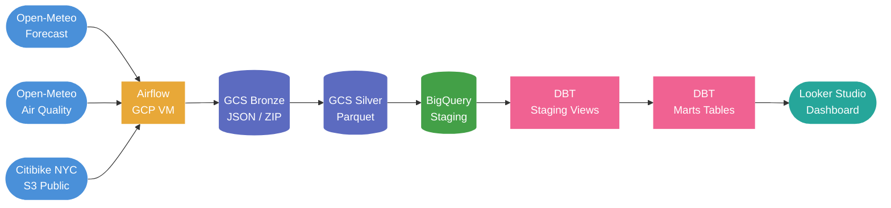
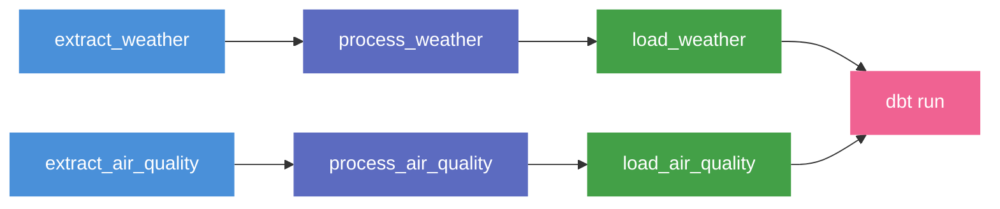
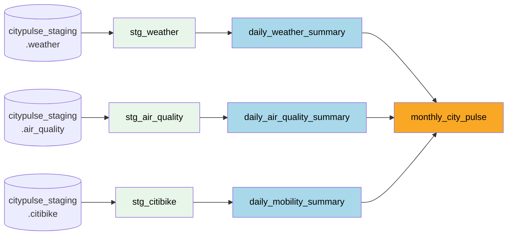
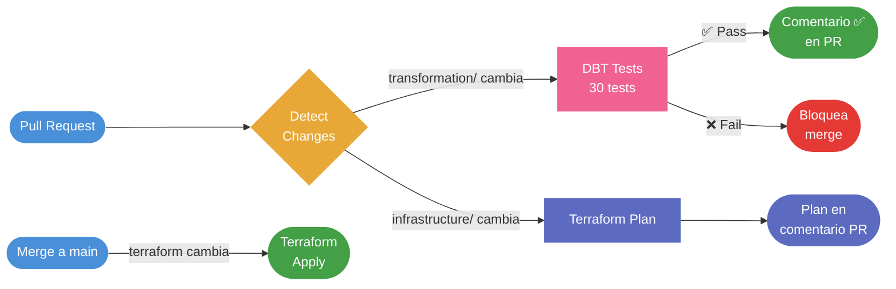

# CityPulse Analytics 🌆

> Pipeline de datos end-to-end que analiza cómo el clima y la calidad del aire
> afectan la movilidad urbana en Nueva York — desde la ingesta hasta el dashboard.

[](https://github.com/TomasRipsky/citypulse_analytics/actions/workflows/deploy.yml)

---

## Índice

1. [Arquitectura](#arquitectura)
2. [Stack Tecnológico](#stack-tecnológico)
3. [Estructura del Repositorio](#estructura-del-repositorio)
4. [Fuentes de Datos](#fuentes-de-datos)
5. [Setup Inicial](#setup-inicial)
6. [Ingesta de Datos](#ingesta-de-datos)
7. [Procesamiento Silver](#procesamiento-silver)
8. [Carga a BigQuery](#carga-a-bigquery)
9. [Transformaciones DBT](#transformaciones-dbt)
10. [Orquestación con Airflow](#orquestación-con-airflow)
11. [Backfill](#backfill)
12. [CI/CD](#cicd)
13. [Fases del Proyecto](#fases-del-proyecto)

---

## Arquitectura

El proyecto sigue la **Arquitectura Medallion** (Bronze → Silver → Gold), un estándar
de la industria que separa claramente cada etapa del ciclo de vida del dato.



### Flujo de orquestación

**DAG Diario** — `0 6 * * *`


**DAG Mensual** — `0 6 8 * *`


### Linaje de datos DBT



---

## Stack Tecnológico

| Capa | Tecnología | Rol |
|------|-----------|-----|
| Lenguaje | Python 3.11 | Extractores, procesadores, loaders |
| Orquestación | Apache Airflow 2.8.1 | Scheduling y dependencias |
| Infraestructura Airflow | GCP VM e2-micro | Hosting gratuito 24/7 |
| Data Lake | Google Cloud Storage | Capas Bronze y Silver |
| Formato Silver | Apache Parquet | Columnar, comprimido, tipado |
| Data Warehouse | BigQuery | Staging y Gold layer |
| Transformaciones | DBT Core 1.7 | Modelos, tests y documentación |
| Infraestructura | Terraform | Infraestructura como código |
| CI/CD | GitHub Actions | DBT tests + Terraform en cada PR |
| Autenticación | Workload Identity Federation | Sin claves JSON |
| Visualización | Looker Studio | Dashboard interactivo |

---

## Estructura del Repositorio

```
citypulse-analytics/
├── .github/workflows/deploy.yml    ← CI/CD: DBT tests + Terraform
├── infrastructure/terraform/
│   ├── main.tf, variables.tf, outputs.tf
│   ├── gcs.tf, bigquery.tf, Iam.tf
│   ├── compute.tf, firewall.tf
├── ingestion/
│   ├── base_extractor.py
│   ├── run_weather.py, run_air_quality.py, run_citibike.py
│   ├── extractors/
│   │   ├── weather_extractor.py    ← forecast + historical endpoint
│   │   ├── air_quality_extractor.py
│   │   └── citibike_extractor.py
│   ├── loaders/gcs_loader.py
│   └── requirements.txt
├── processing/
│   ├── base_processor.py
│   ├── run_weather.py, run_air_quality.py, run_citibike.py
│   ├── processors/
│   │   ├── weather_processor.py
│   │   ├── air_quality_processor.py
│   │   └── citibike_processor.py
│   ├── loaders/gcs_silver_loader.py  ← timestamps UTC microsegundos
│   └── requirements.txt
├── loading/
│   ├── base_loader.py                ← particionado + clustering BigQuery
│   ├── run_weather.py, run_air_quality.py, run_citibike.py
│   ├── loaders/
│   │   ├── weather_loader.py
│   │   ├── air_quality_loader.py
│   │   └── citibike_loader.py
│   └── requirements.txt
├── orchestration/dags/
│   ├── daily_ingestion_dag.py        ← clima + aire + dbt run
│   └── monthly_ingestion_dag.py      ← citibike + dbt run
├── transformation/
│   ├── dbt_project.yml
│   ├── docs/overview.md              ← documentación dbt docs
│   ├── macros/
│   │   ├── generate_schema_name.sql
│   │   └── test_between.sql          ← macro de test reutilizable
│   ├── tests/                        ← tests singulares de calidad
│   │   ├── assert_weather_complete_hours.sql
│   │   ├── assert_air_quality_complete_hours.sql
│   │   ├── assert_mobility_rides_sum.sql
│   │   └── assert_pct_member_range.sql
│   └── models/
│       ├── staging/
│       │   ├── sources.yml
│       │   ├── stg_weather.sql
│       │   ├── stg_air_quality.sql
│       │   └── stg_citibike.sql
│       └── marts/
│           ├── schema.yml            ← 30 tests de calidad de datos
│           ├── daily_weather_summary.sql
│           ├── daily_air_quality_summary.sql
│           ├── daily_mobility_summary.sql
│           └── monthly_city_pulse.sql  ← mart de correlación central
├── backfill.py
├── .env
└── README.md
```

---

## Fuentes de Datos

### Open-Meteo Forecast / Historical
- **Qué provee**: temperatura, precipitación, viento y humedad horarios para NYC
- **Autenticación**: ninguna — sin API key
- **Frecuencia**: diaria
- **Endpoints**: forecast para fechas recientes, archive para fechas históricas

### Open-Meteo Air Quality
- **Qué provee**: PM2.5, PM10, ozono e índice AQI horarios
- **Autenticación**: ninguna — sin API key
- **Frecuencia**: diaria / datos históricos desde 2022

### Citibike NYC Trip Data
- **Qué provee**: viajes en bicicleta — origen, destino, duración, tipo de usuario
- **Formato**: CSV comprimido en ZIP, S3 público de AWS
- **Frecuencia**: mensual (~6 semanas de retraso) / **Volumen**: 3-5M viajes/mes

---

## Setup Inicial

### Pre-requisitos
- Cuenta de GCP con proyecto creado
- Terraform >= 1.5.0 / Python 3.11 / Google Cloud SDK

### 1. Clonar el repositorio
```bash
git clone https://github.com/TomasRipsky/citypulse_analytics.git
cd citypulse-analytics
```

### 2. Variables de entorno locales
Crear `.env` en la raíz:
```bash
GCP_BUCKET_NAME=city-pulse-tr
GOOGLE_CLOUD_PROJECT=your-project-id
```

### 3. Autenticarse en GCP
```bash
gcloud auth application-default login
gcloud config set project your-project-id
```

### 4. Habilitar APIs de GCP
```bash
gcloud services enable \
  iam.googleapis.com iamcredentials.googleapis.com \
  cloudresourcemanager.googleapis.com storage.googleapis.com \
  bigquery.googleapis.com compute.googleapis.com \
  --project=your-project-id
```

### 5. Desplegar infraestructura
```bash
cd infrastructure/terraform
terraform init && terraform plan && terraform apply
```

### 6. Permisos de bootstrap
```bash
gsutil iam ch \
  serviceAccount:citypulse-sa@PROJECT_ID.iam.gserviceaccount.com:roles/storage.admin \
  gs://BUCKET_NAME

gcloud projects add-iam-policy-binding PROJECT_ID \
  --member="serviceAccount:citypulse-sa@PROJECT_ID.iam.gserviceaccount.com" \
  --role="roles/resourcemanager.projectIamAdmin"

gcloud projects add-iam-policy-binding PROJECT_ID \
  --member="serviceAccount:citypulse-sa@PROJECT_ID.iam.gserviceaccount.com" \
  --role="roles/compute.admin"

gcloud iam service-accounts add-iam-policy-binding \
  citypulse-sa@PROJECT_ID.iam.gserviceaccount.com \
  --member="serviceAccount:citypulse-sa@PROJECT_ID.iam.gserviceaccount.com" \
  --role="roles/iam.serviceAccountUser" \
  --project=PROJECT_ID
```

### 7. Workload Identity Federation
```bash
gcloud iam workload-identity-pools create "github-pool" \
  --project="PROJECT_ID" --location="global"

gcloud iam workload-identity-pools providers create-oidc "github-provider" \
  --project="PROJECT_ID" --location="global" \
  --workload-identity-pool="github-pool" \
  --attribute-mapping="google.subject=assertion.sub,attribute.repository=assertion.repository" \
  --attribute-condition="assertion.repository=='USER/REPO'" \
  --issuer-uri="https://token.actions.githubusercontent.com"

gcloud iam service-accounts add-iam-policy-binding \
  citypulse-sa@PROJECT_ID.iam.gserviceaccount.com \
  --role="roles/iam.workloadIdentityUser" \
  --member="principalSet://iam.googleapis.com/projects/PROJECT_NUMBER/locations/global/workloadIdentityPools/github-pool/attribute.repository/USER/REPO"

gcloud iam workload-identity-pools providers describe github-provider \
  --project="PROJECT_ID" --location="global" \
  --workload-identity-pool="github-pool" --format="value(name)"
```

Variables en GitHub — Settings → Secrets and variables → Actions → Variables:

| Variable | Valor |
|----------|-------|
| `GCP_PROJECT_ID` | ID de tu proyecto GCP |
| `GCP_WORKLOAD_IDENTITY_PROVIDER` | Output del comando describe |
| `GCP_SERVICE_ACCOUNT` | Email de la service account |

---

## Ingesta de Datos

```bash
pip install -r ingestion/requirements.txt
```

**Clima:** `python -m ingestion.run_weather [--dry-run] [--date YYYY-MM-DD]`

**Calidad del aire:** `python -m ingestion.run_air_quality [--dry-run] [--date YYYY-MM-DD]`

**Citibike:** `python -m ingestion.run_citibike [--dry-run] [--year YYYY --month MM]`

### Endpoints históricos

El extractor de clima detecta automáticamente si la fecha es histórica:

| Fecha | Endpoint |
|-------|---------|
| Últimos 3 días | `api.open-meteo.com/v1/forecast` |
| Fechas anteriores | `archive-api.open-meteo.com/v1/archive` |

### Estructura en GCS Bronze
```
gs://city-pulse-tr/bronze/
├── weather/year=YYYY/month=MM/day=DD/weather_YYYYMMDD.json
├── air_quality/year=YYYY/month=MM/day=DD/air_quality_YYYYMMDD.json
└── citibike/year=YYYY/month=MM/YYYYMM-citibike-tripdata.zip
```

---

## Procesamiento Silver

```bash
pip install -r processing/requirements.txt

python -m processing.run_weather     [--dry-run] [--date YYYY-MM-DD]
python -m processing.run_air_quality [--dry-run] [--date YYYY-MM-DD]
python -m processing.run_citibike    [--dry-run] [--year YYYY --month MM]
```

### Nota sobre timestamps
Los procesadores serializan los timestamps como `datetime64[us, UTC]` antes
de escribir el Parquet. BigQuery requiere microsegundos con timezone UTC
para reconocerlos como `TIMESTAMP` en lugar de `INT64`.

### Transformaciones aplicadas

| Fuente | Transformaciones |
|--------|-----------------|
| Weather | Arrays horarios → filas, tipos Float64, columnas `date` y `location` |
| Air Quality | Arrays horarios → filas, tipos Float64/Int64, categoría AQI calculada |
| Citibike | Descompresión ZIP, selección de columnas, cálculo de `duration_minutes`, filtro de viajes inválidos |

### Estructura en GCS Silver
```
gs://city-pulse-tr/silver/
├── weather/year=YYYY/month=MM/day=DD/weather_YYYYMMDD.parquet
├── air_quality/year=YYYY/month=MM/day=DD/air_quality_YYYYMMDD.parquet
└── citibike/year=YYYY/month=MM/citibike_YYYYMM.parquet
```

---

## Carga a BigQuery

```bash
pip install -r loading/requirements.txt

python -m loading.run_weather     [--dry-run] [--date YYYY-MM-DD]
python -m loading.run_air_quality [--dry-run] [--date YYYY-MM-DD]
python -m loading.run_citibike    [--dry-run] [--year YYYY --month MM]
```

### Estrategia de carga

| Fuente | Estrategia | Particionado | Clustering |
|--------|-----------|-------------|------------|
| Weather | Delete día + insert | `TIMESTAMP` (día) | `date` |
| Air Quality | Delete día + insert | `TIMESTAMP` (día) | `date` |
| Citibike | Delete mes + insert | `month` (rango) | `member_casual`, `rideable_type` |

El particionado reduce el coste y la latencia de queries en Looker Studio
al limitar el scan a las particiones necesarias. El clustering ordena físicamente
los datos dentro de cada partición por las columnas más filtradas en los marts.

### Tablas en BigQuery Staging

| Tabla | Dataset | Descripción |
|-------|---------|-------------|
| `weather` | `citypulse_staging` | 24 filas/día — datos horarios de clima |
| `air_quality` | `citypulse_staging` | 24 filas/día — datos horarios de calidad del aire |
| `citibike` | `citypulse_staging` | 3-5M filas/mes — viajes en bicicleta |

---

## Transformaciones DBT

DBT lee las tablas de `citypulse_staging` y construye la **capa Gold**
en `citypulse_marts` con 4 modelos, 30 tests de calidad y documentación completa.

### Instalación
```bash
pip install dbt-bigquery==1.7.0 google-cloud-bigquery==3.13.0
```

### Configuración
Crear `~/.dbt/profiles.yml` (fuera del repo — nunca subir a GitHub):
```yaml
citypulse:
  target: dev
  outputs:
    dev:
      type: bigquery
      method: oauth
      project: your-project-id
      dataset: citypulse_marts
      location: us-central1
      threads: 1
```

### Ejecutar
```bash
cd transformation
dbt debug        # verifica la conexión
dbt run          # ejecuta todos los modelos
dbt test         # ejecuta los 30 tests de calidad
dbt docs generate && dbt docs serve --port 8081  # documentación interactiva
```

### Modelos

**Staging** — vistas ligeras sobre las tablas raw:

| Modelo | Tipo | Dataset |
|--------|------|---------|
| `stg_weather` | View | `citypulse_staging` |
| `stg_air_quality` | View | `citypulse_staging` |
| `stg_citibike` | View | `citypulse_staging` |

**Marts** — tablas analíticas para Looker Studio:

| Modelo | Dataset | Descripción |
|--------|---------|-------------|
| `daily_weather_summary` | `citypulse_marts` | Temp media/min/max, precipitación, viento, humedad por día |
| `daily_air_quality_summary` | `citypulse_marts` | AQI medio/max, horas por categoría, categoría dominante por día |
| `daily_mobility_summary` | `citypulse_marts` | Viajes totales, duración, member vs casual, eléctrica vs clásica por día |
| `monthly_city_pulse` | `citypulse_marts` | **Correlación mensual** — une las 3 fuentes para análisis cruzado |

### El mart de correlación — `monthly_city_pulse`

Modelo central del proyecto. Responde preguntas como:

- ¿Los meses más fríos tienen menos viajes en bici?
- ¿La lluvia acumulada mensual reduce el uso de Citibike?
- ¿El viento fuerte desplaza usuarios casual hacia member?
- ¿La mala calidad del aire afecta la duración media de los viajes?
- ¿Las bicis eléctricas se usan más en condiciones adversas?

Incluye métricas derivadas como `rides_per_day`, `casual_rides_per_degree`,
`rides_per_mm_rain` y `conditions_category` (Favorable / Neutral / Adverse).

### Tests de calidad — 30 tests en total

| Tipo | Cantidad | Ejemplos |
|------|---------|---------|
| `not_null` | 8 | `date`, `total_rides`, `aqi_avg` |
| `unique` | 4 | `date` en cada mart diario |
| `accepted_values` | 5 | `weather_category`, `aqi_dominant_category` |
| `between` (macro custom) | 4 | temp -30/50°C, AQI 0/500, humedad 0/100% |
| Singulares (`assert_*`) | 4 | horas completas por día, suma member+casual |

### Granularidad y delay por fuente

| Fuente | Granularidad | Disponibilidad |
|--------|-------------|----------------|
| Weather | Diaria | Al día siguiente |
| Air Quality | Diaria | Al día siguiente |
| Citibike | Mensual | ~6 semanas de retraso |

Los modelos diarios son **independientes** — no hay joins forzados entre ellos.
El join se realiza solo en `monthly_city_pulse` donde la granularidad es mensual.

---

## Orquestación con Airflow

Airflow corre en una **VM e2-micro de GCP (free tier)** como servicio
permanente gestionado por `systemd`.

### ¿Por qué VM y no Cloud Composer?
Cloud Composer cuesta ~375€/mes. La VM e2-micro es permanentemente gratuita
y suficiente gracias al swap de 4GB configurado.

### Configuración de la VM

**Conectarse:**
```bash
gcloud compute ssh citypulse-airflow --zone=us-central1-a --project=PROJECT_ID
```

**Añadir swap:**
```bash
sudo fallocate -l 4G /swapfile
sudo chmod 600 /swapfile && sudo mkswap /swapfile && sudo swapon /swapfile
echo '/swapfile none swap sw 0 0' | sudo tee -a /etc/fstab
```

**Instalar Airflow y dependencias:**
```bash
sudo apt-get update -y && sudo apt-get install -y python3-pip python3-venv git
python3 -m venv ~/airflow-env && source ~/airflow-env/bin/activate
pip install "apache-airflow==2.8.1" \
  --constraint "https://raw.githubusercontent.com/apache/airflow/constraints-2.8.1/constraints-3.10.txt"
pip install -r ~/citypulse_analytics/ingestion/requirements.txt
pip install -r ~/citypulse_analytics/processing/requirements.txt
pip install -r ~/citypulse_analytics/loading/requirements.txt
pip install dbt-bigquery==1.7.0 google-cloud-bigquery==3.13.0
```

> Todas las dependencias deben instalarse en `~/airflow-env`.

**Inicializar y crear usuario:**
```bash
export AIRFLOW_HOME=~/airflow
airflow db init
airflow users create --username admin --password admin \
  --firstname Tu --lastname Nombre --role Admin --email tu@email.com
```

**Configurar como servicio systemd:**
```bash
sudo nano /etc/systemd/system/airflow.service
```
```ini
[Unit]
Description=Airflow Standalone
After=network.target

[Service]
User=usuario
Environment=AIRFLOW_HOME=/home/usuario/airflow
Environment=AIRFLOW__CORE__LOAD_EXAMPLES=False
Environment=PATH=/home/usuario/airflow-env/bin:/usr/local/sbin:/usr/local/bin:/usr/sbin:/usr/bin:/sbin:/bin
Environment=GCP_BUCKET_NAME=city-pulse-tr
ExecStart=/home/usuario/airflow-env/bin/airflow standalone
Restart=always
RestartSec=10

[Install]
WantedBy=multi-user.target
```
```bash
sudo systemctl daemon-reload && sudo systemctl enable airflow && sudo systemctl start airflow
```

**Configurar Airflow Variables** — Admin → Variables en la UI:

| Key | Value |
|-----|-------|
| `citypulse_repo_path` | `/home/usuario/citypulse_analytics` |
| `citypulse_bucket` | `city-pulse-tr` |
| `citypulse_project_id` | `your-project-id` |

**Configurar DBT en la VM:**
```bash
mkdir -p ~/.dbt && nano ~/.dbt/profiles.yml
```
```yaml
citypulse:
  target: dev
  outputs:
    dev:
      type: bigquery
      method: oauth
      project: your-project-id
      dataset: citypulse_marts
      location: us-central1
      threads: 1
```

### Conectar la VM con GitHub (Deploy Key)

```bash
ssh-keygen -t ed25519 -C "citypulse-airflow-vm" -f ~/.ssh/github_key -N ""
cat ~/.ssh/github_key.pub  # añadir en GitHub → Settings → SSH keys

cat >> ~/.ssh/config << 'SSHEOF'
Host github.com
  IdentityFile ~/.ssh/github_key
  User git
SSHEOF

ssh -T git@github.com
git clone git@github.com:TomasRipsky/citypulse_analytics.git
```

### Desplegar los DAGs

**Primera vez:**
```bash
mkdir -p ~/airflow/dags/prod ~/airflow/dags/dev
cp ~/citypulse_analytics/orchestration/dags/*.py ~/airflow/dags/prod/
```

**Actualizar tras un merge:**
```bash
cd ~/citypulse_analytics && git pull
cp orchestration/dags/*.py ~/airflow/dags/prod/
```

### Flujo de trabajo: dev vs prod

```
~/airflow/dags/
├── prod/    ← DAGs mergeados via PR, estables, schedule activo
└── dev/     ← DAGs en desarrollo, experimentales, siempre pausados
```

Convención de `dag_id`:
```python
dag_id="prod.daily_ingestion"   # producción
dag_id="dev.mi_nuevo_dag"       # desarrollo — siempre is_paused_upon_creation=True
```

**Regla:** nunca editar archivos de `prod/` directamente en la VM.

### Acceder a la UI de Airflow

```bash
gcloud compute ssh citypulse-airflow \
  --zone=us-central1-a --project=PROJECT_ID \
  --ssh-flag="-L 8080:localhost:8080" \
  --ssh-flag="-N"
```

Acceder a: `http://localhost:8080` — Credenciales: `admin` / `admin`

### DAGs de producción

| DAG | Schedule | Flujo |
|-----|----------|-------|
| `prod.daily_ingestion` | `0 6 * * *` | extract → process → load (clima + aire en paralelo) → dbt run |
| `prod.monthly_ingestion` | `0 6 8 * *` | extract → process → load (Citibike) → dbt run |

---

## Backfill

Script para cargar datos históricos sin ejecutar el pipeline día a día:

```bash
python backfill.py --dry-run  # verificar sin ejecutar
python backfill.py            # ejecutar backfill completo
```

Los meses a cargar se configuran en `MONTHS_TO_BACKFILL` dentro del script.
Si algún día falla continúa con el siguiente y muestra un resumen al final.

```bash
cd transformation && dbt run  # actualizar marts tras el backfill
```

---

## CI/CD



| Evento | Job | Comportamiento |
|--------|-----|----------------|
| PR con cambios en `transformation/` | DBT Tests | `dbt compile` + `dbt test` — comenta resultado en PR |
| PR con cambios en `infrastructure/terraform/` | Terraform | `terraform plan` — comenta plan en PR |
| Push a `main` con cambios en terraform | Terraform | `terraform apply` automático |

---

## Fases del Proyecto

| Fase | Descripción | Estado |
|------|-------------|--------|
| **1. Infraestructura** | Terraform, GCP, Service Account, WIF, CI/CD | ✅ Completada |
| **2. Ingesta** | Extractores Python, endpoints históricos, GCS Bronze | ✅ Completada |
| **3. Orquestación** | Airflow en GCP VM, DAGs automáticos, Airflow Variables | ✅ Completada |
| **4. Procesamiento** | Transformaciones Silver, Parquet UTC microsegundos | ✅ Completada |
| **5. Warehouse** | BigQuery Staging, particionado, clustering | ✅ Completada |
| **6. Transformación** | 4 modelos DBT, 30 tests, documentación, linaje | ✅ Completada |
| **7. Visualización** | Dashboard Looker Studio con correlación | ✅ Completada |

---

*Proyecto de portfolio — Data Engineering*