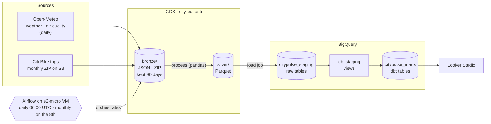
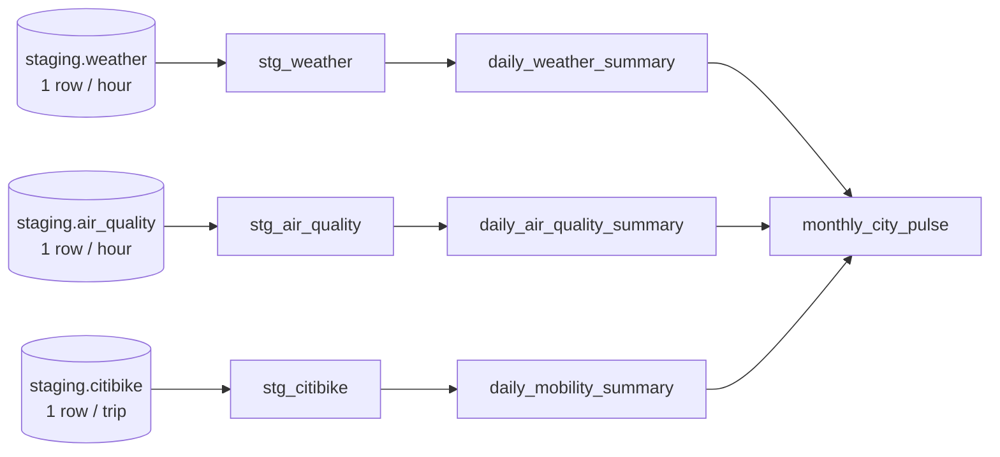
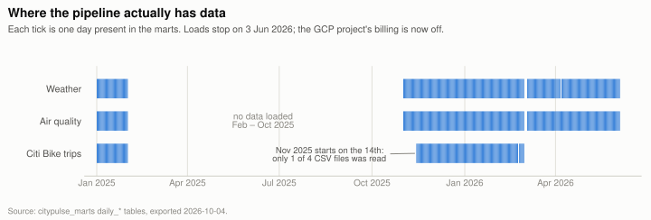
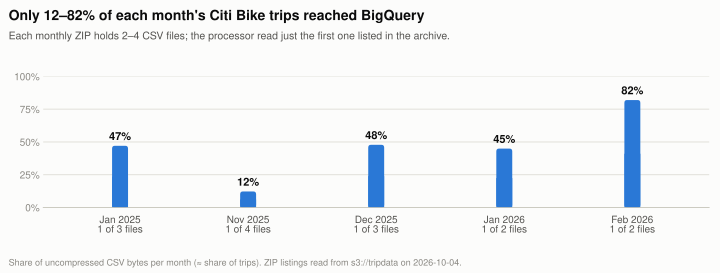
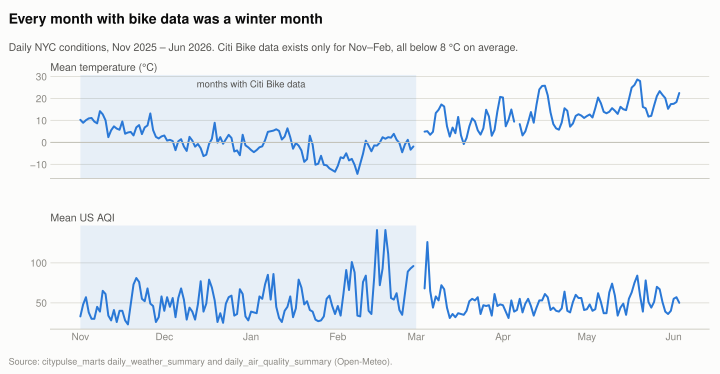

# CityPulse Analytics

**Does the weather change how New York rides bikes?** An end-to-end batch pipeline that lands
hourly weather, air quality and every Citi Bike trip in a Google Cloud lake, models them with dbt
in BigQuery and serves the result to a dashboard.


[](https://github.com/TomasRipsky/CityPulse_Analytics/actions/workflows/deploy.yml)

> [!IMPORTANT]
> **Status — under revision (October 2026).** Built in March 2026, the pipeline ran daily until
> 3 June 2026 and is now stopped. A [full audit](docs/audit/2026-10-04-audit.md) found that only
> 40% of the Citi Bike trips reached the warehouse and that timestamps are local time labelled as
> UTC, among other issues. **Do not use the mobility numbers in the marts.** The fixes and the
> closing plan are being decided; this README describes the system as built.

## The question

Bike share is the most weather-exposed way to move around a city. CityPulse joins three open
sources for New York — hourly weather, hourly air quality and every Citi Bike trip — to ask
whether cold, rain, wind or bad air measurably change how many people ride, who rides (members
or casual riders) and on what (classic or electric bikes).

## Architecture

A medallion layout: raw payloads in **Bronze**, typed Parquet in **Silver**, modelled tables in
**Gold**. Airflow on a free-tier VM runs Python for the first three hops and dbt for the last.



| Hop | Code | What happens |
|---|---|---|
| Extract → Bronze | [`ingestion/`](ingestion/) | Open-Meteo JSON per day (forecast endpoint for the last 3 days, archive before that); the Citi Bike ZIP per month. Retries with exponential backoff. |
| Bronze → Silver | [`processing/`](processing/) | Hourly arrays become rows; types are fixed; AQI category and trip duration are derived; timestamps are written in microseconds so BigQuery reads them as `TIMESTAMP`. |
| Silver → warehouse | [`loading/`](loading/) | BigQuery load jobs from Parquet; each run deletes its day or month first so re-runs do not duplicate. |
| Warehouse → Gold | [`transformation/`](transformation/) | dbt: staging views, three daily marts and a monthly mart that joins all sources. 30 data tests. |
| Orchestration | [`orchestration/dags/`](orchestration/dags/) | `prod.daily_ingestion` (weather + air quality in parallel, then `dbt run`) and `prod.monthly_ingestion` (trips two months back, then `dbt run`). |
| Infrastructure | [`infrastructure/terraform/`](infrastructure/terraform/) | Bucket, datasets, service account, VM and firewall. CI authenticates with Workload Identity Federation — no keys. |

## Data sources

| Source | Data | Cadence | Licence |
|---|---|---|---|
| [Open-Meteo](https://open-meteo.com/) Forecast and Historical Weather APIs | Hourly temperature, precipitation, wind, humidity | Daily, next day | CC BY 4.0 |
| [Open-Meteo](https://open-meteo.com/) Air Quality API | Hourly PM2.5, PM10, ozone, US AQI | Daily, next day | CC BY 4.0 |
| [Citi Bike System Data](https://citibikenyc.com/system-data) | Every trip: start/end time and station, bike type, member or casual | Monthly, ~6 weeks late | [Citi Bike Data License](https://citibikenyc.com/data-sharing-policy) — non-commercial analysis; not republished as a dataset |

Each monthly trip ZIP contains **several** CSV files (one per million trips) — the detail behind
the audit's main finding.

## Data model



| Model | Grain | Holds |
|---|---|---|
| `daily_weather_summary` | one row per day | Mean, min and max temperature; total precipitation; mean and max wind; mean humidity |
| `daily_air_quality_summary` | one row per day | Mean and max AQI, PM2.5, PM10, ozone; hours in each AQI category; dominant category |
| `daily_mobility_summary` | one row per day | Trips, active stations, duration, member vs casual, electric vs classic |
| `monthly_city_pulse` | one row per month | The three summaries joined by month, plus derived indicators and a Favorable / Neutral / Adverse label |

Tests: `not_null`, `unique` and `accepted_values` on keys and labels, a custom `between` range
test, and four singular tests (at least 20 hours per day, member + casual = total, percentage range).

## What the warehouse holds

History was backfilled when the project was built in March 2026 (January 2025, then November
2025 onwards); daily runs followed until 3 June 2026.

<picture>
  <source media="(prefers-color-scheme: dark)" srcset="docs/img/coverage-dark.svg">
  
</picture>

Weather and air quality are complete and trustworthy at daily grain. Trips are not: only part of
each month was loaded.

<picture>
  <source media="(prefers-color-scheme: dark)" srcset="docs/img/citibike-loaded-dark.svg">
  
</picture>

And every month that has trips is a winter month, so the question cannot be answered yet:

<picture>
  <source media="(prefers-color-scheme: dark)" srcset="docs/img/daily-conditions-dark.svg">
  
</picture>

Charts are generated from warehouse exports by [`docs/audit/charts.py`](docs/audit/charts.py).

## Known issues

The [audit](docs/audit/2026-10-04-audit.md) lists 20 findings with evidence. The ones that matter
most:

| | Issue |
|---|---|
| **C1** | Only the first CSV of each monthly ZIP is read — 40% of trips loaded |
| **C2** | The only cross-source model is monthly: five winter rows cannot show a weather effect; its ratio metrics explode near 0 °C |
| **H1** | Local New York times are stored as UTC (off by 4–5 h) |
| **H2** | CI runs dbt tests against production tables, not the pull request's models |
| **H3** | A failed delete is swallowed and followed by an append (duplicates); the documented partitioning does not exist |
| **H4** | One service account, usable from any branch, holds `projectIamAdmin` |

## Repository

```
.github/workflows/deploy.yml   CI: dbt compile + test, Terraform plan on PRs; apply on main
infrastructure/terraform/      GCS bucket, BigQuery datasets, service account, VM, firewall
ingestion/                     extractors (Open-Meteo, Citi Bike) and the Bronze writer
processing/                    Bronze → Silver processors and the Parquet writer
loading/                       Silver → BigQuery loaders
orchestration/dags/            daily and monthly Airflow DAGs
transformation/                dbt project: staging, marts, tests, macros, docs
backfill.py                    one-off historical load for weather and air quality
docs/
  audit/                       the 2026-10 audit, its data exports and chart scripts
  decisions/                   architecture decision records
  img/                         charts (light and dark)
  operations.md                how it was deployed and operated (March–June 2026)
```

## Decisions

Why it is built this way — the medallion lake, Airflow on a free-tier VM instead of Cloud
Composer, delete-then-append loads, keyless CI — is recorded in [`docs/decisions/`](docs/decisions/).

## Running it

The pipeline needs a GCP project with billing, a VM with Airflow and several manual IAM steps.
The full procedure as it was operated is in [`docs/operations.md`](docs/operations.md); it will be
replaced once the closing plan is agreed. Every extractor, processor and loader also runs on its
own, for example:

```bash
python -m ingestion.run_weather --date 2026-01-15 --dry-run
```

## Credits

Weather and air-quality data by [Open-Meteo.com](https://open-meteo.com/) (CC BY 4.0). Trip data
from [Citi Bike System Data](https://citibikenyc.com/system-data), used under the Citi Bike Data
License; this project is not affiliated with Citi Bike or Lyft.
