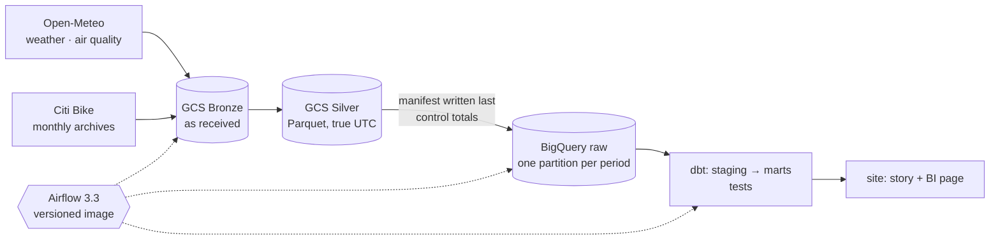

# CityPulse

**Does the weather change how New York rides bikes?** A batch data pipeline that lands every Citi
Bike trip and every hour of New York's weather and air quality in Google Cloud, models them with
dbt in BigQuery, orchestrates them with Airflow — and answers the question.

**→ [The answers, as a site](https://tomasripsky.github.io/CityPulse_Analytics/)** · **[the BI page](https://tomasripsky.github.io/CityPulse_Analytics/bi): filter it yourself**


[](https://github.com/TomasRipsky/CityPulse_Analytics/actions/workflows/citypulse-ci.yml)

## The answer

One year of data, May 2025 – April 2026: **44.5 million trips**, 365 New York days of hourly
weather and air quality. Each condition is compared with the same hour (or day), kind of day and
month in good weather, so the season does not pass for weather.

| Condition | Trips vs good weather | |
|---|---|---|
| Drizzle (< 1 mm in the hour) | **−24%** | casual riders −33%, members −22% |
| Rain (1–4 mm in the hour) | **−46%** | casual −52%, members −44% |
| Snow (≥ 5 cm in the day) | **−62%** | 4 days only |
| Wind (gusts 55–70 km/h) | −5% | barely matters |
| "Moderate" air quality | +5% | does not keep riders home (often warm, sunny days) |
| Each °C a dry day feels warmer than usual for the month | **+2.7%** | casual +4.0%, members +2.5% |

Associations measured carefully, not proof of cause. On 23 February 2026 the system was shut for a
blizzard — the data shows zero trips, and the closure is excluded from every comparison.

## How it works



- **Nothing lost on the way:** every CSV of every monthly archive is read, its rows counted on the
  raw bytes and reconciled through Silver, the BigQuery load and a dbt test.
- **Time is right:** true UTC instants, New York days (23 and 25 hours when the clocks change),
  rain moved to the hour it fell in.
- **Safe to re-run:** a failed run leaves the last good data; a load replaces exactly one partition.
- **Built from code, least privilege:** two GCP projects by Terraform, one service account with no
  IAM rights, keyless CI (Workload Identity Federation), budgets and query quotas.

The full story — every part, every choice, every problem hit — is in **[the guide](docs/guide.md)**
and the **[decision records](docs/decisions/)**.

## Run it

Requirements: [uv](https://docs.astral.sh/uv/), Python 3.12+, and for the cloud parts `gcloud`,
Terraform ≥ 1.9, Docker.

```bash
make setup                                          # environment + git hooks
make test                                           # ~90 tests, offline
uv run citypulse ingest weather --from 2025-03-09   # into ./.lake — 23 hours: clocks went forward
uv run citypulse ingest trips --from 2025-01        # 2,124,475 trips, ~1 minute
```

In your own GCP project (`make help` lists everything):

```bash
make bootstrap ENV=dev BILLING_ACCOUNT=… ORG_ID=…   # project, billing link, €5 budget alert
make apply ENV=dev                                  # Terraform: lake, datasets, tables, identity
make airflow-up ENV=dev                             # Airflow 3.3 on 127.0.0.1:8080
make transform ENV=dev                              # dbt build: models + every test
make site-data ENV=dev && make site-preview         # the site, locally
make destroy ENV=dev                                # tear everything down (tested)
```

## Cost

About **€0 a month**: BigQuery and Cloud Storage free tiers, no always-on compute (Airflow runs on
the operator's machine when needed), a €5 budget alert per project and daily query quotas (20 GiB
dev, 50 GiB prod) as a hard stop. A full dbt build on the year of data reads about 20 GB.

## What changed in version 2

CityPulse was first built in March 2026 and rebuilt in October 2026. Version 1 loaded only the first
CSV of each monthly archive (40% of the trips), stored New York times as UTC, compared months with
ratios that exploded near 0 °C and tested production instead of the change under review. Version 2
fixes all of it — see the [changelog](CHANGELOG.md).

## What I learned

- **Tests only see what they look at.** Version 1's tests all passed while 60% of the trips were
  missing: every row that arrived was consistent. Only a count taken at the source can catch rows
  that never arrived.
- **Time zones fail quietly.** An API's "local day" turned out to be one fixed offset, and local
  times stored as UTC still produced plausible daily totals. Instants in UTC, local days as their own
  column, and tests on the days the clocks change.
- **Compare like with like — and not with yourself.** A baseline that includes the periods it is
  compared with forces the effects to cancel out; a code review caught it before any number was
  published.
- **Make every step boring to re-run.** A laptop that went to sleep mid-backfill cost nothing but a
  re-run, because every step validates before it publishes and replaces exactly what it owns.

## Credits

Weather and air-quality data by [Open-Meteo.com](https://open-meteo.com/) (CC BY 4.0). Trip data
from [Citi Bike System Data](https://citibikenyc.com/system-data), used under the Citi Bike Data
License for non-commercial analysis; this project is not affiliated with Citi Bike or Lyft.
