<div align="center">

# 🌆 CityPulse Analytics

### Pipeline de datos end-to-end sobre clima, calidad del aire y movilidad urbana en Nueva York

[](https://github.com/TomasRipsky/citypulse_analytics/actions/workflows/deploy.yml)


</div>

---

## ✨ Highlights

<div align="center">

| 📡 3 fuentes de datos | 🔄 2 DAGs productivos | 🧪 30 data quality tests | 🏗️ 100% IaC |
|:---:|:---:|:---:|:---:|
| Open-Meteo + Citibike | Diario + Mensual | dbt tests + singulares | Terraform + WIF |

</div>

> **Pregunta central:** ¿Cómo afectan el clima y la calidad del aire al uso de bicicletas compartidas en NYC?
> El mart `monthly_city_pulse` cruza las tres fuentes para responderla con métricas de correlación.

---

## 📐 Arquitectura

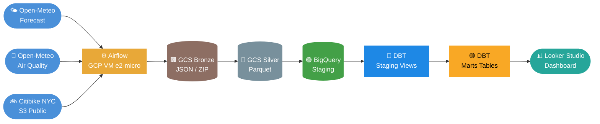

### Capas de la Arquitectura Medallion

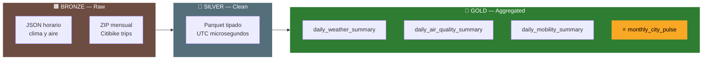

---

## 🛠️ Stack Tecnológico

<div align="center">

| Capa | Tecnología | Descripción |
|:----:|:----------:|:------------|
| 🐍 Lenguaje | **Python 3.11** | Extractores, procesadores, loaders |
| ⚙️ Orquestación | **Apache Airflow 2.8.1** | Scheduling, dependencias, alertas |
| ☁️ Compute | **GCP VM e2-micro** | Hosting Airflow — free tier 24/7 |
| 🪣 Data Lake | **Google Cloud Storage** | Capas Bronze y Silver |
| 📦 Formato | **Apache Parquet** | Columnar, comprimido, tipado |
| 🏭 Warehouse | **BigQuery** | Staging + Gold con particionado |
| 🔄 Transforms | **dbt Core 1.7** | Modelos, 30 tests, documentación |
| 🏗️ Infra | **Terraform** | Infraestructura como código |
| 🚀 CI/CD | **GitHub Actions** | dbt tests + Terraform automático |
| 🔐 Auth | **Workload Identity Federation** | Sin claves JSON en el repo |
| 📊 Viz | **Looker Studio** | Dashboard interactivo público |

</div>

---

## 📁 Estructura del Repositorio

```
citypulse-analytics/
│
├── 📂 .github/workflows/
│   └── deploy.yml              ← CI/CD: dbt tests + Terraform
│
├── 📂 infrastructure/terraform/
│   ├── main.tf  variables.tf  outputs.tf
│   ├── gcs.tf   bigquery.tf   compute.tf
│   └── Iam.tf   firewall.tf
│
├── 📂 ingestion/               ← Bronze layer
│   ├── base_extractor.py
│   ├── extractors/
│   │   ├── weather_extractor.py      ← forecast + archive endpoint
│   │   ├── air_quality_extractor.py
│   │   └── citibike_extractor.py
│   └── loaders/gcs_loader.py
│
├── 📂 processing/              ← Silver layer
│   ├── base_processor.py
│   ├── processors/
│   │   ├── weather_processor.py
│   │   ├── air_quality_processor.py
│   │   └── citibike_processor.py
│   └── loaders/gcs_silver_loader.py  ← datetime64[us, UTC]
│
├── 📂 loading/                 ← BigQuery Staging
│   ├── base_loader.py                ← particionado + clustering
│   └── loaders/
│       ├── weather_loader.py
│       ├── air_quality_loader.py
│       └── citibike_loader.py
│
├── 📂 orchestration/dags/
│   ├── daily_ingestion_dag.py        ← clima + aire + dbt run
│   └── monthly_ingestion_dag.py      ← citibike + dbt run
│
├── 📂 transformation/          ← Gold layer (dbt)
│   ├── macros/
│   │   ├── generate_schema_name.sql
│   │   └── test_between.sql          ← macro de test custom
│   ├── tests/                        ← 4 tests singulares
│   └── models/
│       ├── staging/   stg_weather · stg_air_quality · stg_citibike
│       └── marts/     daily_weather · daily_air_quality · daily_mobility · monthly_city_pulse ⭐
│
├── backfill.py                 ← carga histórica por rango de fechas
└── README.md
```

---

## 📡 Fuentes de Datos

<div align="center">

| | Fuente | Datos | Frecuencia | Auth |
|:---:|:---|:---|:---:|:---:|
| 🌤️ | **Open-Meteo Forecast** | Temperatura, precipitación, viento, humedad | Diaria | Sin API key |
| 💨 | **Open-Meteo Air Quality** | PM2.5, PM10, ozono, AQI horario | Diaria | Sin API key |
| 🚲 | **Citibike NYC (S3)** | Viajes, duración, tipo de usuario, bici | Mensual | Público |

</div>

> El extractor de clima detecta automáticamente si la fecha es histórica y selecciona el endpoint correcto:
> fechas recientes → `api.open-meteo.com/v1/forecast` · fechas pasadas → `archive-api.open-meteo.com/v1/archive`

---

## 🔄 Transformaciones dbt

### Linaje de datos

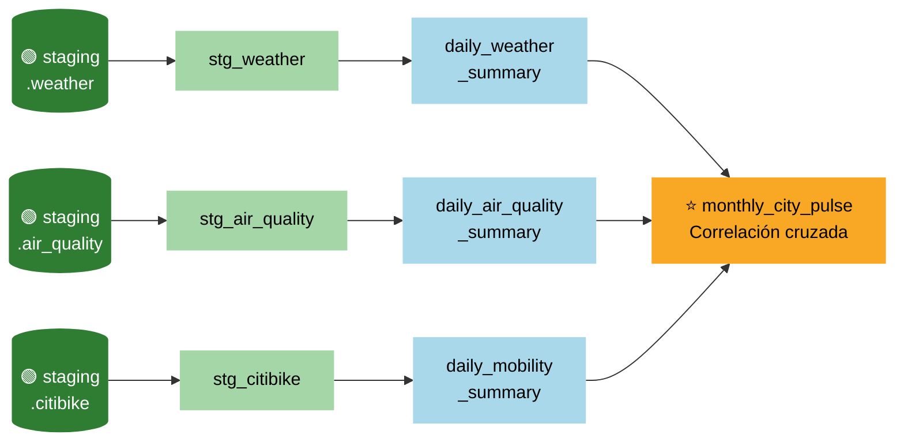

### Modelos

| Modelo | Tipo | Granularidad | Descripción |
|:-------|:----:|:------------:|:------------|
| `stg_weather` | View | Hora | Datos crudos de clima tipados |
| `stg_air_quality` | View | Hora | PM2.5, PM10, AQI tipados |
| `stg_citibike` | View | Viaje | Filtro de rides cross-month |
| `daily_weather_summary` | Table | **Día** | Temp media/min/max, precipitación, viento |
| `daily_air_quality_summary` | Table | **Día** | AQI medio/max, categoría dominante |
| `daily_mobility_summary` | Table | **Día** | Viajes totales, duración, member vs casual |
| ⭐ `monthly_city_pulse` | Table | **Mes** | Join de las 3 fuentes — correlación cruzada |

### Tests de calidad — 30 tests en total

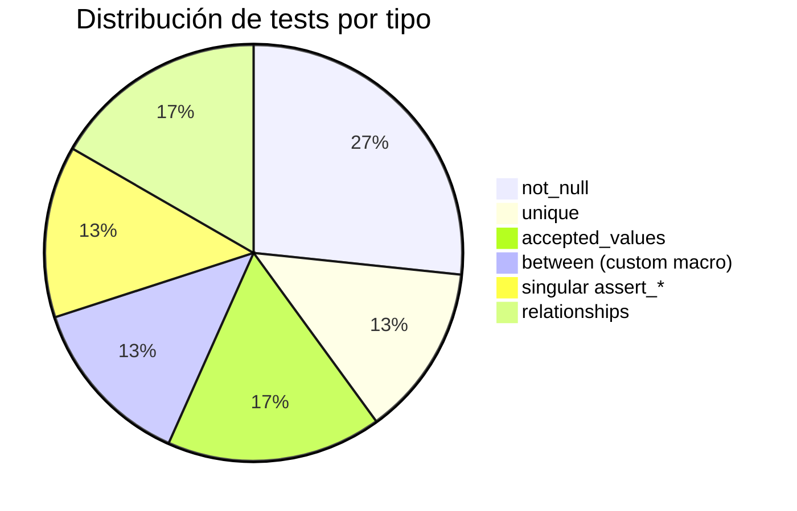

### ⭐ `monthly_city_pulse` — El mart de correlación

Responde preguntas como:

- 🌡️ ¿Los meses más fríos reducen el uso de Citibike?
- 🌧️ ¿La lluvia acumulada mensual desplaza riders al metro?
- 💨 ¿El viento fuerte cambia la proporción casual/member?
- 😷 ¿La mala calidad del aire acorta la duración media de los viajes?
- ⚡ ¿Las bicis eléctricas se usan más en condiciones adversas?
<div align="center">

# 🌆 CityPulse Analytics

### End-to-end data pipeline analyzing the relationship between weather, air quality, and urban mobility in New York City

[](https://github.com/TomasRipsky/citypulse_analytics/actions/workflows/deploy.yml)


</div>

---

## ✨ Highlights

<div align="center">

| 📡 3 data sources | 🔄 2 production DAGs | 🧪 30 data quality tests | 🏗️ 100% IaC |
|:---:|:---:|:---:|:---:|
| Open-Meteo + Citibike | Daily + Monthly | dbt tests + singular | Terraform + WIF |

</div>

> **Core question:** How do weather and air quality affect Citibike ridership in NYC?
> The `monthly_city_pulse` mart joins all three sources to answer it with cross-source correlation metrics.

---

## 📑 Table of Contents

1. [Architecture](#architecture)
2. [Tech Stack](#tech-stack)
3. [Repository Structure](#repository-structure)
4. [Data Sources](#data-sources)
5. [Initial Setup](#initial-setup)
6. [Data Ingestion](#data-ingestion)
7. [Silver Processing](#silver-processing)
8. [Loading to BigQuery](#loading-to-bigquery)
9. [dbt Transformations](#dbt-transformations)
10. [Airflow Orchestration](#airflow-orchestration)
11. [Backfill](#backfill)
12. [CI/CD](#cicd)
13. [Project Phases](#project-phases)

---

## 📐 Architecture

The project follows the **Medallion Architecture** (Bronze → Silver → Gold), an industry standard that clearly separates each stage of the data lifecycle.


### Medallion Layers

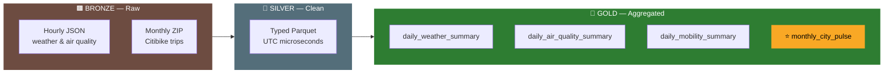

### Orchestration Flow

**Daily DAG** — `0 6 * * *`


**Monthly DAG** — `0 6 8 * *` *(targets execution month − 2 months due to Citibike's ~6-week delay)*


### dbt Lineage

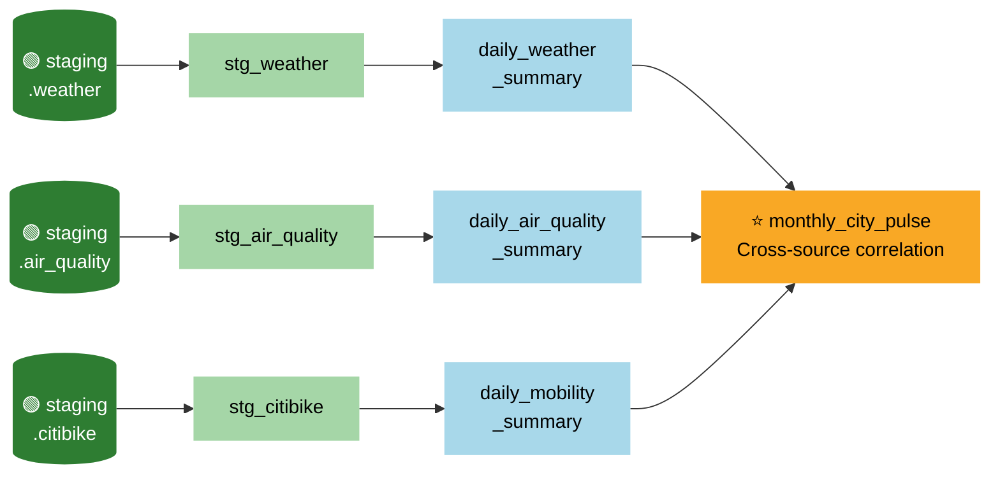

---

## 🛠️ Tech Stack

<div align="center">

| Layer | Technology | Role |
|:-----:|:----------:|:-----|
| 🐍 Language | **Python 3.11** | Extractors, processors, loaders |
| ⚙️ Orchestration | **Apache Airflow 2.8.1** | Scheduling and task dependencies |
| ☁️ Compute | **GCP VM e2-micro** | Airflow host — always-free tier |
| 🪣 Data Lake | **Google Cloud Storage** | Bronze and Silver layers |
| 📦 Format | **Apache Parquet** | Columnar, compressed, typed |
| 🏭 Warehouse | **BigQuery** | Staging + Gold with partitioning |
| 🔄 Transforms | **dbt Core 1.7** | Models, 30 tests, documentation |
| 🏗️ Infrastructure | **Terraform** | Infrastructure as Code |
| 🚀 CI/CD | **GitHub Actions** | dbt tests + Terraform on every PR |
| 🔐 Auth | **Workload Identity Federation** | No JSON keys in the repo |
| 📊 Visualization | **Looker Studio** | Interactive public dashboard |

</div>

---

## 📁 Repository Structure

```
citypulse-analytics/
│
├── 📂 .github/workflows/
│   └── deploy.yml                  ← CI/CD: dbt tests + Terraform
│
├── 📂 infrastructure/terraform/
│   ├── main.tf  variables.tf  outputs.tf
│   ├── gcs.tf   bigquery.tf   compute.tf
│   └── Iam.tf   firewall.tf
│
├── 📂 ingestion/                   ← Bronze layer
│   ├── base_extractor.py
│   ├── run_weather.py  run_air_quality.py  run_citibike.py
│   ├── extractors/
│   │   ├── weather_extractor.py    ← auto-selects forecast vs archive endpoint
│   │   ├── air_quality_extractor.py
│   │   └── citibike_extractor.py
│   ├── loaders/gcs_loader.py
│   └── requirements.txt
│
├── 📂 processing/                  ← Silver layer
│   ├── base_processor.py
│   ├── run_weather.py  run_air_quality.py  run_citibike.py
│   ├── processors/
│   │   ├── weather_processor.py
│   │   ├── air_quality_processor.py
│   │   └── citibike_processor.py
│   ├── loaders/gcs_silver_loader.py  ← serializes datetime64[us, UTC]
│   └── requirements.txt
│
├── 📂 loading/                     ← BigQuery Staging
│   ├── base_loader.py              ← partitioning + clustering support
│   ├── run_weather.py  run_air_quality.py  run_citibike.py
│   ├── loaders/
│   │   ├── weather_loader.py       ← TimePartitioning(day) + clustering(date)
│   │   ├── air_quality_loader.py   ← TimePartitioning(day) + clustering(date)
│   │   └── citibike_loader.py      ← RangePartitioning(month) + clustering(member_casual, rideable_type)
│   └── requirements.txt
│
├── 📂 orchestration/dags/
│   ├── daily_ingestion_dag.py      ← weather + air quality + dbt run
│   └── monthly_ingestion_dag.py    ← citibike + dbt run
│
├── 📂 transformation/              ← Gold layer (dbt)
│   ├── dbt_project.yml
│   ├── docs/overview.md            ← dbt docs site overview
│   ├── macros/
│   │   ├── generate_schema_name.sql  ← prevents dataset name concatenation
│   │   └── test_between.sql          ← reusable custom test macro
│   ├── tests/                        ← singular data quality tests
│   │   ├── assert_weather_complete_hours.sql
│   │   ├── assert_air_quality_complete_hours.sql
│   │   ├── assert_mobility_rides_sum.sql
│   │   └── assert_pct_member_range.sql
│   └── models/
│       ├── staging/
│       │   ├── sources.yml
│       │   ├── stg_weather.sql
│       │   ├── stg_air_quality.sql
│       │   └── stg_citibike.sql       ← filters cross-month rides to prevent duplicates
│       └── marts/
│           ├── schema.yml             ← 30 data quality tests defined here
│           ├── daily_weather_summary.sql
│           ├── daily_air_quality_summary.sql
│           ├── daily_mobility_summary.sql
│           └── monthly_city_pulse.sql ← ⭐ central correlation mart
│
├── backfill.py                     ← historical load by date range
├── .env
└── README.md
```

---

## 📡 Data Sources

<div align="center">

| | Source | Data Provided | Frequency | Auth |
|:---:|:---|:---|:---:|:---:|
| 🌤️ | **Open-Meteo Forecast / Historical** | Temperature, precipitation, wind, humidity (hourly) | Daily | No API key |
| 💨 | **Open-Meteo Air Quality** | PM2.5, PM10, ozone, AQI (hourly) | Daily | No API key |
| 🚲 | **Citibike NYC Trip Data (S3)** | Trips, duration, user type, bike type | Monthly | Public |

</div>

The weather extractor automatically detects whether the target date is historical and selects the correct endpoint:

| Date range | Endpoint used |
|:-----------|:-------------|
| Last 3 days | `api.open-meteo.com/v1/forecast` |
| Older dates | `archive-api.open-meteo.com/v1/archive` |

**GCS Bronze structure:**
```
gs://city-pulse-tr/bronze/
├── weather/year=YYYY/month=MM/day=DD/weather_YYYYMMDD.json
├── air_quality/year=YYYY/month=MM/day=DD/air_quality_YYYYMMDD.json
└── citibike/year=YYYY/month=MM/YYYYMM-citibike-tripdata.zip
```

---

## 🔧 Initial Setup

<details>
<summary><b>1. Prerequisites and clone</b></summary>

**Required tools:**
- GCP account with a project created
- Terraform >= 1.5.0
- Python 3.11
- Google Cloud SDK (`gcloud`)

```bash
git clone https://github.com/TomasRipsky/citypulse_analytics.git
cd citypulse-analytics
```
</details>

<details>
<summary><b>2. Local environment variables</b></summary>

Create a `.env` file at the root:
```bash
GCP_BUCKET_NAME=city-pulse-tr
GOOGLE_CLOUD_PROJECT=your-project-id
```
</details>

<details>
<summary><b>3. Authenticate to GCP and enable APIs</b></summary>

```bash
gcloud auth application-default login
gcloud config set project your-project-id

gcloud services enable \
  iam.googleapis.com \
  iamcredentials.googleapis.com \
  cloudresourcemanager.googleapis.com \
  storage.googleapis.com \
  bigquery.googleapis.com \
  compute.googleapis.com \
  --project=your-project-id
```
</details>

<details>
<summary><b>4. Deploy infrastructure with Terraform</b></summary>

```bash
cd infrastructure/terraform
terraform init
terraform plan
terraform apply
```

This creates:
- GCS bucket `city-pulse-tr` with Bronze and Silver prefixes
- BigQuery datasets `citypulse_staging` and `citypulse_marts` (us-central1)
- VM `citypulse-airflow` (e2-micro, us-central1-a)
- Service account `citypulse-sa` with required IAM roles
- Firewall rules
</details>

<details>
<summary><b>5. Bootstrap IAM permissions</b></summary>

Some permissions need to be granted manually after the initial Terraform apply, either because they are self-referential or because they require project-level admin access:

```bash
# Grant Storage Admin on the bucket to the service account
gsutil iam ch \
  serviceAccount:citypulse-sa@PROJECT_ID.iam.gserviceaccount.com:roles/storage.admin \
  gs://BUCKET_NAME

# Allow the SA to manage IAM policies at project level (needed by Terraform)
gcloud projects add-iam-policy-binding PROJECT_ID \
  --member="serviceAccount:citypulse-sa@PROJECT_ID.iam.gserviceaccount.com" \
  --role="roles/resourcemanager.projectIamAdmin"

# Allow the SA to manage Compute resources (VM creation/deletion)
gcloud projects add-iam-policy-binding PROJECT_ID \
  --member="serviceAccount:citypulse-sa@PROJECT_ID.iam.gserviceaccount.com" \
  --role="roles/compute.admin"

# Allow the SA to impersonate itself (required for Workload Identity Federation)
gcloud iam service-accounts add-iam-policy-binding \
  citypulse-sa@PROJECT_ID.iam.gserviceaccount.com \
  --member="serviceAccount:citypulse-sa@PROJECT_ID.iam.gserviceaccount.com" \
  --role="roles/iam.serviceAccountUser" \
  --project=PROJECT_ID
```

> **Why these permissions?** `projectIamAdmin` lets Terraform manage future IAM bindings without manual intervention. `compute.admin` lets it manage the Airflow VM lifecycle. The self-referential `serviceAccountUser` binding is required by Workload Identity Federation to allow the SA to generate short-lived tokens for GitHub Actions.
</details>

<details>
<summary><b>6. Set up Workload Identity Federation (no JSON keys)</b></summary>

WIF allows GitHub Actions to authenticate to GCP using OIDC tokens instead of long-lived service account JSON keys — a significantly more secure approach.

```bash
# Create the identity pool
gcloud iam workload-identity-pools create "github-pool" \
  --project="PROJECT_ID" \
  --location="global"

# Create the OIDC provider linked to GitHub Actions
gcloud iam workload-identity-pools providers create-oidc "github-provider" \
  --project="PROJECT_ID" \
  --location="global" \
  --workload-identity-pool="github-pool" \
  --attribute-mapping="google.subject=assertion.sub,attribute.repository=assertion.repository" \
  --attribute-condition="assertion.repository=='USER/REPO'" \
  --issuer-uri="https://token.actions.githubusercontent.com"

# Allow GitHub Actions (from this specific repo) to impersonate the SA
gcloud iam service-accounts add-iam-policy-binding \
  citypulse-sa@PROJECT_ID.iam.gserviceaccount.com \
  --role="roles/iam.workloadIdentityUser" \
  --member="principalSet://iam.googleapis.com/projects/PROJECT_NUMBER/locations/global/workloadIdentityPools/github-pool/attribute.repository/USER/REPO"

# Get the provider resource name (you'll need this for GitHub Variables)
gcloud iam workload-identity-pools providers describe github-provider \
  --project="PROJECT_ID" \
  --location="global" \
  --workload-identity-pool="github-pool" \
  --format="value(name)"
```

Then add these GitHub Variables under **Settings → Secrets and variables → Actions → Variables**:

| Variable | Value |
|:---------|:------|
| `GCP_PROJECT_ID` | Your GCP project ID |
| `GCP_WORKLOAD_IDENTITY_PROVIDER` | Output from the `describe` command above |
| `GCP_SERVICE_ACCOUNT` | `citypulse-sa@PROJECT_ID.iam.gserviceaccount.com` |
</details>

<details>
<summary><b>7. Set up Airflow on the GCP VM</b></summary>

**Connect to the VM:**
```bash
gcloud compute ssh citypulse-airflow --zone=us-central1-a --project=PROJECT_ID
```

**Add 4GB swap** (required — e2-micro only has 1GB RAM):
```bash
sudo fallocate -l 4G /swapfile
sudo chmod 600 /swapfile
sudo mkswap /swapfile
sudo swapon /swapfile
echo '/swapfile none swap sw 0 0' | sudo tee -a /etc/fstab
```

**Install Airflow and all dependencies:**
```bash
sudo apt-get update -y && sudo apt-get install -y python3-pip python3-venv git

python3 -m venv ~/airflow-env
source ~/airflow-env/bin/activate

pip install "apache-airflow==2.8.1" \
  --constraint "https://raw.githubusercontent.com/apache/airflow/constraints-2.8.1/constraints-3.10.txt"

pip install -r ~/citypulse_analytics/ingestion/requirements.txt
pip install -r ~/citypulse_analytics/processing/requirements.txt
pip install -r ~/citypulse_analytics/loading/requirements.txt

# Pin google-cloud-bigquery to avoid compatibility issue with dbt-bigquery 1.7
pip install dbt-bigquery==1.7.0 google-cloud-bigquery==3.13.0
```

> ⚠️ All dependencies must be installed inside `~/airflow-env`. This is the virtualenv that systemd uses to run Airflow and all DAG tasks.

**Initialize Airflow and create admin user:**
```bash
export AIRFLOW_HOME=~/airflow
airflow db init
airflow users create \
  --username admin \
  --password admin \
  --firstname Your \
  --lastname Name \
  --role Admin \
  --email your@email.com
```

**Configure Airflow as a systemd service** (auto-restarts on reboot):
```bash
sudo nano /etc/systemd/system/airflow.service
```
```ini
[Unit]
Description=Airflow Standalone
After=network.target

[Service]
User=usuario
Environment=AIRFLOW_HOME=/home/usuario/airflow
Environment=AIRFLOW__CORE__LOAD_EXAMPLES=False
Environment=PATH=/home/usuario/airflow-env/bin:/usr/local/sbin:/usr/local/bin:/usr/sbin:/usr/bin:/sbin:/bin
Environment=GCP_BUCKET_NAME=city-pulse-tr
ExecStart=/home/usuario/airflow-env/bin/airflow standalone
Restart=always
RestartSec=10

[Install]
WantedBy=multi-user.target
```
```bash
sudo systemctl daemon-reload
sudo systemctl enable airflow
sudo systemctl start airflow
```

**Configure dbt on the VM:**

Create `~/.dbt/profiles.yml` (keep this file outside the repo — never commit it):
```yaml
citypulse:
  target: dev
  outputs:
    dev:
      type: bigquery
      method: oauth        # uses the VM's attached service account
      project: your-project-id
      dataset: citypulse_marts
      location: us-central1
      threads: 1
```

**Set Airflow Variables** (Admin → Variables in the UI):

| Key | Value | Purpose |
|:----|:------|:--------|
| `citypulse_repo_path` | `/home/usuario/citypulse_analytics` | Path to the cloned repo on the VM |
| `citypulse_bucket` | `city-pulse-tr` | GCS bucket name |
| `citypulse_project_id` | `your-project-id` | GCP project ID |

> DAGs read config via `Variable.get("key", default_var="...")` instead of hardcoded constants, making the pipeline portable without code changes.
</details>

<details>
<summary><b>8. Connect the VM to GitHub (Deploy Key)</b></summary>

DAGs pull the latest code from GitHub on every task run. This requires an SSH deploy key:

```bash
# Generate a dedicated SSH key for this VM
ssh-keygen -t ed25519 -C "citypulse-airflow-vm" -f ~/.ssh/github_key -N ""

# Print the public key — add this in GitHub → Settings → Deploy keys
cat ~/.ssh/github_key.pub

# Configure SSH to use this key for GitHub
cat >> ~/.ssh/config << 'SSHEOF'
Host github.com
  IdentityFile ~/.ssh/github_key
  User git
SSHEOF

# Verify the connection
ssh -T git@github.com

# Clone the repo
git clone git@github.com:TomasRipsky/citypulse_analytics.git
```
</details>

<details>
<summary><b>9. Deploy DAGs</b></summary>

**First time:**
```bash
mkdir -p ~/airflow/dags/prod ~/airflow/dags/dev
cp ~/citypulse_analytics/orchestration/dags/*.py ~/airflow/dags/prod/
```

**After each merge to main:**
```bash
cd ~/citypulse_analytics && git pull
cp orchestration/dags/*.py ~/airflow/dags/prod/
```

**DAG directory convention:**

```
~/airflow/dags/
├── prod/    ← merged via PR, stable, active schedule
└── dev/     ← experimental, always is_paused_upon_creation=True
```

DAG ID naming convention:
```python
dag_id="prod.daily_ingestion"   # production
dag_id="dev.my_new_dag"         # development — always paused on creation
```

> **Rule:** never edit files in `prod/` directly on the VM. All changes go through a PR.

**Development workflow for new DAGs:**
1. Create the file in VS Code via Remote SSH → `~/airflow/dags/dev/my_dag.py`
2. Airflow detects it within ~30 seconds
3. Test with manual trigger from the UI
4. When working → copy to repo → PR → merge → deploy to `prod/`

**Connect VS Code to the VM:**
```bash
# Run once on your local machine
gcloud compute config-ssh --project=PROJECT_ID
```
Then in VS Code: `Ctrl+Shift+P` → `Remote-SSH: Connect to Host` → `citypulse-airflow`
</details>

<details>
<summary><b>10. Access the Airflow UI</b></summary>

Port 8080 is blocked on most home ISPs. Open an SSH tunnel before accessing the UI and keep it open while you use it:

```bash
gcloud compute ssh citypulse-airflow \
  --zone=us-central1-a \
  --project=PROJECT_ID \
  --ssh-flag="-L 8080:localhost:8080" \
  --ssh-flag="-N"
```

Then open: `http://localhost:8080` — Credentials: `admin` / `admin`
</details>

---

## 📥 Data Ingestion

```bash
pip install -r ingestion/requirements.txt
```

| Source | Command |
|:-------|:--------|
| Weather | `python -m ingestion.run_weather [--dry-run] [--date YYYY-MM-DD]` |
| Air Quality | `python -m ingestion.run_air_quality [--dry-run] [--date YYYY-MM-DD]` |
| Citibike | `python -m ingestion.run_citibike [--dry-run] [--year YYYY --month MM]` |

All extractors support `--dry-run` to validate without writing to GCS.

---

## 🥈 Silver Processing

Reads raw files from GCS Bronze, applies type casting and transformations, and writes clean Parquet to GCS Silver.

```bash
pip install -r processing/requirements.txt

python -m processing.run_weather     [--dry-run] [--date YYYY-MM-DD]
python -m processing.run_air_quality [--dry-run] [--date YYYY-MM-DD]
python -m processing.run_citibike    [--dry-run] [--year YYYY --month MM]
```

### Transformations applied

| Source | Transformations |
|:-------|:---------------|
| Weather | Hourly arrays → rows, Float64 types, `date` and `location` columns added |
| Air Quality | Hourly arrays → rows, Float64/Int64 types, AQI category calculated |
| Citibike | ZIP decompression, column selection, `duration_minutes` calculated, invalid trips filtered |

### Timestamp serialization

All processors serialize timestamps as `datetime64[us, UTC]` before writing Parquet. BigQuery requires microsecond precision with UTC timezone to interpret the column as `TIMESTAMP` instead of `INT64`.

**GCS Silver structure:**
```
gs://city-pulse-tr/silver/
├── weather/year=YYYY/month=MM/day=DD/weather_YYYYMMDD.parquet
├── air_quality/year=YYYY/month=MM/day=DD/air_quality_YYYYMMDD.parquet
└── citibike/year=YYYY/month=MM/citibike_YYYYMM.parquet
```

---

## 🏭 Loading to BigQuery

Reads Parquet files from GCS Silver and loads them into `citypulse_staging` in BigQuery.

```bash
pip install -r loading/requirements.txt

python -m loading.run_weather     [--dry-run] [--date YYYY-MM-DD]
python -m loading.run_air_quality [--dry-run] [--date YYYY-MM-DD]
python -m loading.run_citibike    [--dry-run] [--year YYYY --month MM]
```

### Load strategy

| Source | Strategy | Reason |
|:-------|:---------|:-------|
| Weather | Delete day + insert | Incremental daily accumulation |
| Air Quality | Delete day + insert | Incremental daily accumulation |
| Citibike | Delete month + insert | Full monthly file replacement |

### Partitioning and clustering

Tables are created with partitioning and clustering to reduce query costs and improve Looker Studio latency:

| Table | Partitioning | Clustering |
|:------|:------------|:-----------|
| `weather` | `TIMESTAMP` (DAY) | `date` |
| `air_quality` | `TIMESTAMP` (DAY) | `date` |
| `citibike` | `month` (RANGE 1–12) | `member_casual`, `rideable_type` |

Partitioning limits the bytes scanned to only the relevant time ranges. Clustering physically orders data within each partition by the most-filtered columns in the marts.

### BigQuery Staging tables

| Table | Dataset | Description |
|:------|:--------|:------------|
| `weather` | `citypulse_staging` | 24 rows/day — hourly weather data |
| `air_quality` | `citypulse_staging` | 24 rows/day — hourly air quality data |
| `citibike` | `citypulse_staging` | 3–5M rows/month — bike trips |

---

## 🔄 dbt Transformations

dbt reads from `citypulse_staging` and builds the **Gold layer** in `citypulse_marts` with 4 models, 30 quality tests, and full column-level documentation.

### Installation

```bash
# Pin google-cloud-bigquery to avoid AttributeError with dbt-bigquery 1.7
pip install dbt-bigquery==1.7.0 google-cloud-bigquery==3.13.0
```

### Configuration

Create `~/.dbt/profiles.yml` **outside the repo** (never commit this file):
```yaml
citypulse:
  target: dev
  outputs:
    dev:
      type: bigquery
      method: oauth
      project: your-project-id
      dataset: citypulse_marts
      location: us-central1
      threads: 1
```

### Run dbt

```bash
cd transformation
dbt debug                                        # verify connection
dbt run                                          # execute all models
dbt test                                         # run all 30 quality tests
dbt docs generate && dbt docs serve --port 8081  # interactive documentation site
```

### Models

**Staging** — lightweight views over raw tables:

| Model | Type | Dataset | Description |
|:------|:----:|:-------:|:------------|
| `stg_weather` | View | `citypulse_staging` | Typed hourly weather |
| `stg_air_quality` | View | `citypulse_staging` | Typed hourly air quality |
| `stg_citibike` | View | `citypulse_staging` | Trips filtered to prevent cross-month duplicates |

**Marts** — aggregated tables for Looker Studio:

| Model | Type | Granularity | Description |
|:------|:----:|:-----------:|:------------|
| `daily_weather_summary` | Table | Day | Avg/min/max temp, precipitation, wind, humidity |
| `daily_air_quality_summary` | Table | Day | Avg/max AQI, hours per category, dominant category |
| `daily_mobility_summary` | Table | Day | Total trips, avg duration, % member vs casual, % electric |
| ⭐ `monthly_city_pulse` | Table | Month | Cross-source join — correlation mart |

### Data quality tests — 30 total

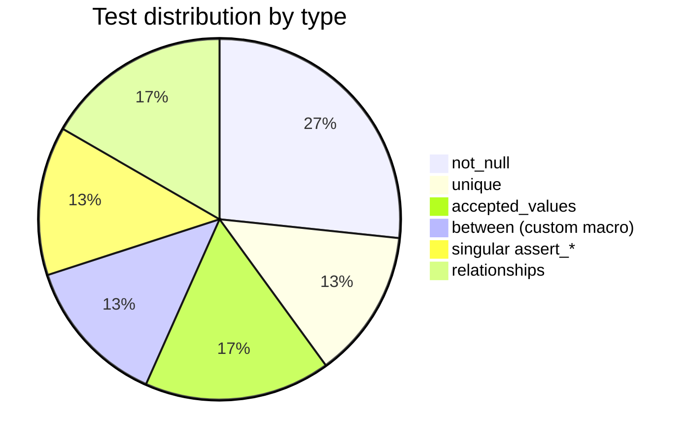

| Type | Count | Examples |
|:-----|:-----:|:---------|
| `not_null` | 8 | `date`, `total_rides`, `aqi_avg` |
| `unique` | 4 | `date` on each daily mart |
| `accepted_values` | 5 | `weather_category`, `aqi_dominant_category` |
| `between` (custom macro) | 4 | temp −30/50°C, AQI 0/500, humidity 0/100% |
| Singular `assert_*` | 4 | ≥20 hours/day, member + casual = total_rides |
| `relationships` | 5 | referential integrity between staging and marts |

The `test_between` macro is a reusable generic test that validates any numeric column stays within expected bounds — used across multiple models without duplication.

The `generate_schema_name` macro overrides dbt's default behavior that concatenates the `profiles.yml` dataset with the `dbt_project.yml` `+schema`, which would produce names like `citypulse_marts_citypulse_staging`. The macro ensures the dataset name is used as-is.

### ⭐ `monthly_city_pulse` — The correlation mart

This is the central analytical model of the project. It joins all three daily summaries at monthly granularity to answer cross-source questions:

- 🌡️ Do colder months see fewer Citibike rides?
- 🌧️ Does monthly accumulated rainfall reduce ridership?
- 💨 Does strong wind shift the casual-to-member ratio?
- 😷 Does poor air quality shorten average trip duration?
- ⚡ Are electric bikes used more under adverse conditions?

Derived metrics included: `rides_per_day`, `casual_rides_per_degree`, `rides_per_mm_rain`, `conditions_category` (Favorable / Neutral / Adverse), `weather_category` (Freezing / Cold / Mild / Warm / Hot).

### Data granularity and availability delay

| Source | Granularity | Availability |
|:-------|:-----------:|:-------------|
| Weather | Daily | Next day |
| Air Quality | Daily | Next day |
| Citibike | Monthly | ~6 weeks after month end |

The three daily models are **independent** — there are no forced joins between them that would propagate Citibike's delay to the weather and air quality dashboards. The join happens only in `monthly_city_pulse` where monthly granularity makes it natural.

---

## ⚙️ Airflow Orchestration

Airflow runs on a **GCP e2-micro VM (free tier)** as a permanent service managed by `systemd`.

> **Why a VM instead of Cloud Composer?** Cloud Composer costs ~$375/month. The e2-micro VM is permanently free and sufficient for this workload thanks to the 4GB swap configured during setup.

### Production DAGs

| DAG | Schedule | Description |
|:----|:--------:|:------------|
| `prod.daily_ingestion` | `0 6 * * *` | Weather + air quality: extract → process → load (parallel) → dbt run |
| `prod.monthly_ingestion` | `0 6 8 * *` | Citibike: extract → process → load → dbt run |

Both DAGs use `catchup=False` and read all configuration from Airflow Variables — no hardcoded paths or project IDs.

---

## 📜 Backfill

Script to load historical data without running the pipeline day by day manually.

```bash
python backfill.py --dry-run  # preview what would run without executing
python backfill.py            # run the full backfill
```

Configure the months to load in the `MONTHS_TO_BACKFILL` variable inside the script. If a single day fails, the script continues with the next one and prints a summary at the end.

After backfilling, update the Gold marts:
```bash
cd transformation && dbt run
```

---

## 🚀 CI/CD

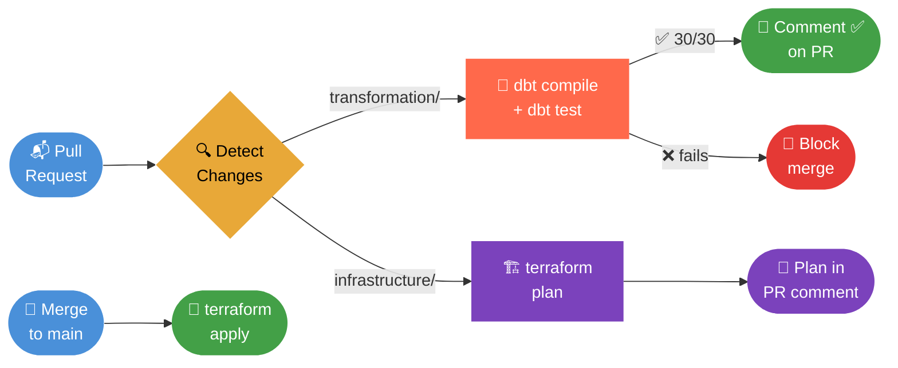

The pipeline uses a `changes` job with `dorny/paths-filter` to detect which directories were modified, then activates only the relevant downstream jobs:

| Trigger | Job | Action |
|:--------|:---:|:-------|
| PR touching `transformation/` | **dbt Tests** | `dbt compile` + `dbt test` — comments ✅/❌ on the PR and blocks merge on failure |
| PR touching `infrastructure/terraform/` | **Terraform** | `terraform plan` — comments the plan on the PR |
| Push to `main` touching terraform files | **Terraform** | `terraform apply` — automatic deployment |

Authentication uses Workload Identity Federation (configured in step 6 above) — no service account JSON keys are stored in GitHub Secrets.

---

## ✅ Project Phases

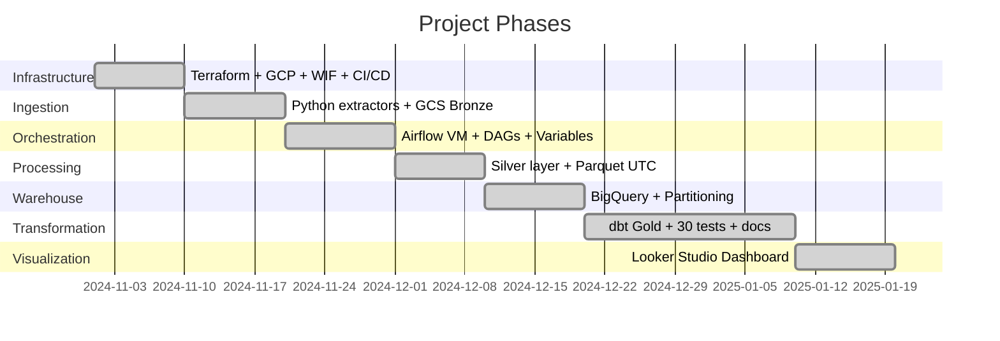

| # | Phase | Description | Status |
|:-:|:------|:------------|:------:|
| 1 | **Infrastructure** | Terraform, GCP, Service Account, WIF, CI/CD | ✅ |
| 2 | **Ingestion** | 3 Python extractors, historical endpoints, GCS Bronze | ✅ |
| 3 | **Orchestration** | Airflow on GCP VM, automated DAGs, Airflow Variables | ✅ |
| 4 | **Processing** | Silver layer, Parquet `datetime64[us, UTC]` | ✅ |
| 5 | **Warehouse** | BigQuery Staging, time partitioning, clustering | ✅ |
| 6 | **Transformation** | 4 dbt models, 30 tests, documentation, lineage | ✅ |
| 7 | **Visualization** | Looker Studio dashboard with correlation mart | ✅ |

---

<div align="center">

*Portfolio project · Data Engineering · GCP · Python · dbt · Airflow*

</div>
---

## ⚙️ Orquestación con Airflow

**DAG Diario** — `0 6 * * *`
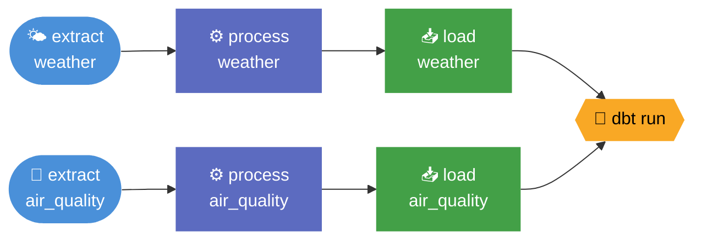

**DAG Mensual** — `0 6 8 * *` *(datos del mes: ejecución - 2 meses)*
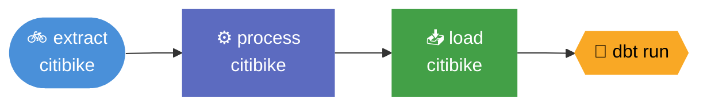

> **¿Por qué VM y no Cloud Composer?**
> Cloud Composer cuesta ~375€/mes. La VM e2-micro es free tier permanente con 4GB de swap — suficiente para este workload.

---

## 🚀 CI/CD

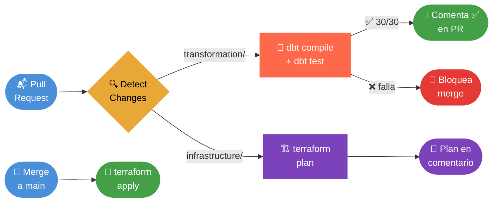

| Trigger | Job activado | Acción |
|:--------|:------------:|:-------|
| PR con cambios en `transformation/` | **dbt Tests** | `dbt compile` + `dbt test` — comenta ✅/❌ en el PR |
| PR con cambios en `infrastructure/terraform/` | **Terraform** | `terraform plan` — comenta el plan en el PR |
| Push a `main` con cambios en terraform | **Terraform** | `terraform apply` automático |

---

## 📦 Setup Inicial

<details>
<summary><b>1. Pre-requisitos y clonado</b></summary>

```bash
# Pre-requisitos: GCP account, Terraform >= 1.5, Python 3.11, gcloud SDK
git clone https://github.com/TomasRipsky/citypulse_analytics.git
cd citypulse-analytics
```
</details>

<details>
<summary><b>2. Variables de entorno</b></summary>

Crear `.env` en la raíz:
```bash
GCP_BUCKET_NAME=city-pulse-tr
GOOGLE_CLOUD_PROJECT=your-project-id
```
</details>

<details>
<summary><b>3. Autenticación GCP y APIs</b></summary>

```bash
gcloud auth application-default login
gcloud config set project your-project-id

gcloud services enable \
  iam.googleapis.com iamcredentials.googleapis.com \
  cloudresourcemanager.googleapis.com storage.googleapis.com \
  bigquery.googleapis.com compute.googleapis.com \
  --project=your-project-id
```
</details>

<details>
<summary><b>4. Desplegar infraestructura (Terraform)</b></summary>

```bash
cd infrastructure/terraform
terraform init && terraform plan && terraform apply
```
</details>

<details>
<summary><b>5. Workload Identity Federation (sin claves JSON)</b></summary>

```bash
gcloud iam workload-identity-pools create "github-pool" \
  --project="PROJECT_ID" --location="global"

gcloud iam workload-identity-pools providers create-oidc "github-provider" \
  --project="PROJECT_ID" --location="global" \
  --workload-identity-pool="github-pool" \
  --attribute-mapping="google.subject=assertion.sub,attribute.repository=assertion.repository" \
  --attribute-condition="assertion.repository=='USER/REPO'" \
  --issuer-uri="https://token.actions.githubusercontent.com"

gcloud iam service-accounts add-iam-policy-binding \
  citypulse-sa@PROJECT_ID.iam.gserviceaccount.com \
  --role="roles/iam.workloadIdentityUser" \
  --member="principalSet://iam.googleapis.com/projects/PROJECT_NUMBER/locations/global/workloadIdentityPools/github-pool/attribute.repository/USER/REPO"
```

Variables en GitHub → Settings → Secrets → Variables:

| Variable | Valor |
|----------|-------|
| `GCP_PROJECT_ID` | ID de tu proyecto GCP |
| `GCP_WORKLOAD_IDENTITY_PROVIDER` | Output del comando describe |
| `GCP_SERVICE_ACCOUNT` | Email de la service account |
</details>

<details>
<summary><b>6. Setup Airflow en la VM</b></summary>

```bash
# Conectarse
gcloud compute ssh citypulse-airflow --zone=us-central1-a --project=PROJECT_ID

# Swap (necesario en e2-micro)
sudo fallocate -l 4G /swapfile
sudo chmod 600 /swapfile && sudo mkswap /swapfile && sudo swapon /swapfile
echo '/swapfile none swap sw 0 0' | sudo tee -a /etc/fstab

# Instalar dependencias
python3 -m venv ~/airflow-env && source ~/airflow-env/bin/activate
pip install "apache-airflow==2.8.1" \
  --constraint "https://raw.githubusercontent.com/apache/airflow/constraints-2.8.1/constraints-3.10.txt"
pip install -r ~/citypulse_analytics/ingestion/requirements.txt
pip install -r ~/citypulse_analytics/processing/requirements.txt
pip install -r ~/citypulse_analytics/loading/requirements.txt
pip install dbt-bigquery==1.7.0 google-cloud-bigquery==3.13.0
```

Airflow Variables (Admin → Variables en la UI):

| Key | Value |
|-----|-------|
| `citypulse_repo_path` | `/home/usuario/citypulse_analytics` |
| `citypulse_bucket` | `city-pulse-tr` |
| `citypulse_project_id` | `your-project-id` |

Acceso a la UI via SSH tunnel:
```bash
gcloud compute ssh citypulse-airflow \
  --zone=us-central1-a --project=PROJECT_ID \
  --ssh-flag="-L 8080:localhost:8080" --ssh-flag="-N"
# → http://localhost:8080  (admin / admin)
```
</details>

<details>
<summary><b>7. Ejecutar pipeline manualmente</b></summary>

```bash
# Ingesta
python -m ingestion.run_weather     --date 2025-11-01
python -m ingestion.run_air_quality --date 2025-11-01
python -m ingestion.run_citibike    --year 2025 --month 11

# Procesamiento Silver
python -m processing.run_weather     --date 2025-11-01
python -m processing.run_air_quality --date 2025-11-01
python -m processing.run_citibike    --year 2025 --month 11

# Carga a BigQuery
python -m loading.run_weather     --date 2025-11-01
python -m loading.run_air_quality --date 2025-11-01
python -m loading.run_citibike    --year 2025 --month 11

# Transformaciones dbt
cd transformation && dbt run && dbt test
```
</details>

<details>
<summary><b>8. Backfill histórico</b></summary>

```bash
python backfill.py --dry-run  # previsualizar sin ejecutar
python backfill.py            # ejecutar

cd transformation && dbt run  # actualizar marts tras el backfill
```
</details>

---

## ✅ Estado del Proyecto


| # | Fase | Descripción | Estado |
|:-:|:-----|:------------|:------:|
| 1 | **Infraestructura** | Terraform, GCP, Service Account, WIF, CI/CD | ✅ |
| 2 | **Ingesta** | 3 extractores Python, endpoints históricos, GCS Bronze | ✅ |
| 3 | **Orquestación** | Airflow en GCP VM, DAGs automáticos, Airflow Variables | ✅ |
| 4 | **Procesamiento** | Silver layer, Parquet `datetime64[us, UTC]` | ✅ |
| 5 | **Warehouse** | BigQuery Staging, particionado por tiempo, clustering | ✅ |
| 6 | **Transformación** | 4 modelos dbt, 30 tests, documentación, linaje | ✅ |
| 7 | **Visualización** | Dashboard Looker Studio con mart de correlación | ✅ |

---

<div align="center">

*Proyecto de portfolio · Data Engineering · GCP · Python · dbt · Airflow*

</div>