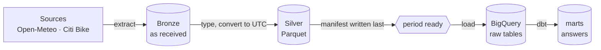
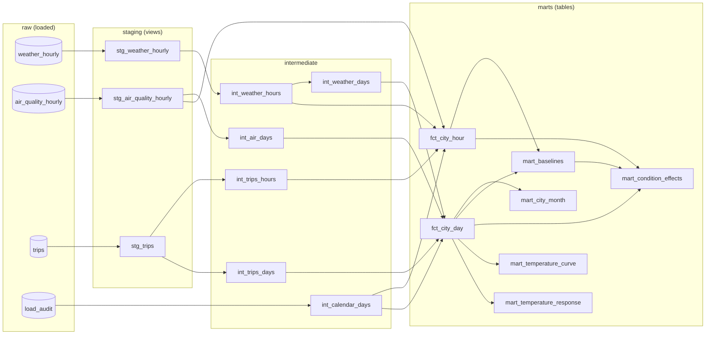
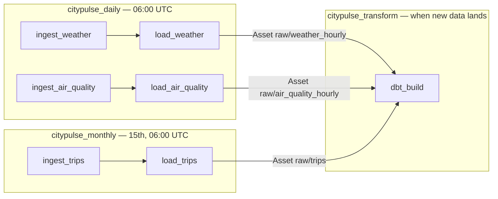

# How CityPulse works

This guide explains the system from the inside: what each part does, why it is built that way,
what it costs, and what went wrong on the way. It is written for someone who knows Python and SQL
but has not seen this project. The README says *what* and *how to run*; this file says *how* and
*why*. Decisions are argued in full in [`decisions/`](decisions/).

**Contents**

1. [The big picture](#1-the-big-picture)
2. [The lake](#2-the-lake)
3. [Ingestion: weather and air quality](#3-ingestion-weather-and-air-quality)
4. [Ingestion: Citi Bike trips](#4-ingestion-citi-bike-trips)
5. [Control totals and the success manifest](#5-control-totals-and-the-success-manifest)
6. [Talking to the internet: retries and downloads](#6-talking-to-the-internet-retries-and-downloads)
7. [How the code is tested](#7-how-the-code-is-tested)
8. [The cloud: projects, Terraform and identities](#8-the-cloud-projects-terraform-and-identities)
9. [Loading the warehouse](#9-loading-the-warehouse)
10. [Modelling with dbt](#10-modelling-with-dbt)
11. [How the weather effects are measured](#11-how-the-weather-effects-are-measured)
12. [Orchestration with Airflow](#12-orchestration-with-airflow)
13. [The showcase site](#13-the-showcase-site)

---

## 1. The big picture

CityPulse asks one question: **does the weather change how New York rides bikes?** Answering it
needs three things measured for the same place and the same hours:

| Source | What it gives us | Grain | How often |
|---|---|---|---|
| Open-Meteo weather | temperature, "feels like", rain, snow, wind, gusts, humidity, clouds, weather code | one row per hour | daily |
| Open-Meteo air quality | PM2.5, PM10, ozone, NO₂, US AQI | one row per hour | daily |
| Citi Bike System Data | every trip: start/end time and station, bike type, member or casual rider | one row per trip | monthly, ~6 weeks late |

The data moves through layers, each with one job:



This is the **medallion** pattern. Bronze keeps the source's answer untouched, so any later step
can be replayed without asking the source again. Silver is the same data typed, with correct
instants, in a columnar format that warehouses load cheaply. The warehouse and dbt (next
chapters) turn it into answers.

Everything is driven by one command line, `citypulse`, from one Python package in `src/citypulse/`:

| Module | Job |
|---|---|
| `lake.py` | where files live (local folder or GCS bucket) and the one place the path layout is written |
| `http.py` | HTTP with retries, and downloads that are verified before they are kept |
| `openmeteo.py` | ask Open-Meteo for one New York day and turn the answer into a typed table |
| `citibike.py` | find every trip CSV in a monthly ZIP, count its rows, stream it to Parquet in UTC |
| `ingest.py` | land one period: Bronze → Silver → manifest, in that order |
| `cli.py` | `citypulse ingest …` |

Try it on your laptop — no cloud account needed:

```bash
make setup
uv run citypulse ingest weather --from 2025-03-09          # 23 hours: clocks went forward
uv run citypulse ingest trips --from 2025-01               # 2,124,475 trips, ~1 minute
```

---

## 2. The lake

A *data lake* here is just a folder of files with a fixed layout. `Lake` (in `lake.py`) wraps one
root — a local path such as `.lake`, or `gs://bucket` — behind a handful of methods
(`write_bytes`, `parquet_writer`, `read_table`, `list`, `delete_dir`…). Underneath it is
`pyarrow.fs`, Apache Arrow's filesystem layer, which speaks both local disk and Google Cloud
Storage. That is why the same code runs in tests (a temporary folder), on a laptop (`.lake/`) and
in production (a bucket) — only the root changes, through `CITYPULSE_LAKE_URI`.

```
bronze/weather/date=2025-01-15/weather.json
bronze/air_quality/date=2025-01-15/air_quality.json
bronze/citibike/month=2025-01/source.json      (the archive's record; the ZIP stays at its source)
silver/weather/date=2025-01-15/part.parquet
silver/citibike/month=2025-01/part-000.parquet … part-002.parquet
_manifests/weather/2025-01-15.json
_manifests/citibike/2025-01.json
```

**Why `key=value` folders?** It is the *Hive partitioning* convention: tools such as BigQuery,
Spark and DuckDB read `date=2025-01-15` as a column, and can skip whole folders when a query
filters on it. One key per source is enough: the daily sources are keyed by the New York day
they describe, trips by the month of the file they came from.

**Why are the path functions in one module?** Every step must agree on where the previous step
wrote. Version 1 rebuilt the same path string in six modules; the smallest change to one copy
would have broken the hand-off silently. Now `bronze_day()`, `silver_trips_part()`,
`manifest_path()` and friends are the only place a path is spelled out, and a test pins the
exact layout.

**Object stores are not file systems.** On GCS a "folder" is only a name prefix, so there is no
atomic "rename the folder when it is complete". That is the reason for the manifest
(chapter 5). `Lake` also only creates directories on local disk: on GCS, `create_dir` could
create a *bucket*, which is never what we want.

---

## 3. Ingestion: weather and air quality

### What we ask for

`openmeteo.fetch()` sends one request per source and day to the
[Open-Meteo](https://open-meteo.com/) APIs: the historical **archive** for days more than a week
old, the **forecast** API (which also serves recent past days) for the last week, and the **air
quality** API. Coordinates are City Hall, Manhattan. No API key is needed; the data is CC BY 4.0.

```
timezone=GMT  timeformat=unixtime  start_date=D  end_date=D+1  hourly=temperature_2m,…
```

### Time, the subtle part

A timestamp only means something with its timezone. `2025-01-15 17:00` in New York is
`2025-01-15 22:00` UTC in winter and would be `21:00` UTC in summer. The rule we follow
([decision 0010](decisions/0010-true-utc-instants-and-new-york-days.md)):

- **store instants in UTC**, as `timestamp[us, tz=UTC]` — unambiguous, comparable across sources;
- **keep the local calendar day as its own column** (`local_date`), because "a day" for a cyclist
  is a New York day, midnight to midnight.

Asking Open-Meteo for `timeformat=unixtime` returns epoch seconds — a count of seconds since
1970 in UTC — so there is nothing to interpret. The catch is *which hours make up a New York day*.
A New York day starts at 05:00 UTC in winter and 04:00 UTC in summer, so it spans two UTC dates.
We request both (48 hours) and keep the hours whose New York date is the day we want:

| Day | Why it is special | Hours kept | First hour (UTC) |
|---|---|---|---|
| 15 Jan 2025 | normal winter day | 24 | 05:00 |
| 9 Mar 2025 | clocks jump 02:00 → 03:00 | **23** | 05:00 |
| 2 Nov 2025 | clocks fall back, 01:00 happens twice | **25** | 04:00 |

> **Problem we hit.** The obvious request — `timezone=America/New_York` — returns 24 hours on
> every day, at one fixed UTC offset (the response has a single `utc_offset_seconds`). On the two
> daylight-saving days that window is shifted by an hour, so one real hour is missing and another
> belongs to the neighbouring day. Verified against the live API on 2026-10-04, which is why the
> request is made in UTC and the day is cut on our side with Python's `zoneinfo`.

**Only finished days.** A New York day is ingested only once it is over (after the next local
midnight). Before that, the API would answer with forecasts, and they would be stored as if they
had been observed.

**Hours are stamped at their end for some variables.** Temperature, humidity, cloud cover and
wind speed are readings *at* the stamped instant. `precipitation`, `rain` and `snowfall` are the
total of the **preceding** hour, and `wind_gusts_10m` its maximum: the value stamped 08:00 is what
fell between 07:00 and 08:00. Bronze and Silver keep Open-Meteo's stamps untouched; the dbt models
shift those four variables back one hour before summing them into days or joining them with the
trips of that hour.

### Turning the answer into a table

`openmeteo.to_table()` is also a small **contract**: it refuses an answer that is not what we
asked for, instead of loading something subtly wrong.

- `utc_offset_seconds` must be 0 and every time must be an integer (unix seconds);
- every requested variable must be present — a renamed variable fails with its name;
- the kept hours must be exactly the length of that New York day, one hour apart.

Columns are `observed_at`, `local_date`, then one column per variable under the API's own name
(`temperature_2m`, `us_aqi`…), doubles except the two codes (`weather_code`, `us_aqi`), which are
integers. A missing value (`null`) is **kept**: the archive sometimes lacks an hour for one
variable, and dropping the row would lose the others. Instead the number of nulls per column goes
into the manifest, where the warehouse tests can see it.

---

## 4. Ingestion: Citi Bike trips

### The source

Citi Bike publishes one ZIP per month on a public S3 bucket
(`https://s3.amazonaws.com/tripdata/YYYYMM-citibike-tripdata.zip`), about six weeks after the
month ends. Inside are **several CSV files, one per million trips** — between two and four in the
months checked, more in a busy summer month:

| Month | Files | Trips |
|---|---|---|
| Jan 2025 | `_1`, `_2`, `_3` | 2,124,475 |
| Nov 2025 | `_1` … `_4` | ~3.4 M |

> **Problem we hit.** Version 1 opened the first `.csv` it found in the archive and stopped. The
> order inside a ZIP is whatever the publisher's tool wrote — November 2025 lists `_4` first —
> so it loaded between 12% and 82% of each month, and every test still passed. `trip_members()`
> now returns **every** CSV, in name order, skipping things that are not trip files (macOS
> `__MACOSX/` metadata, readmes, folders).

The columns, identical from January 2025 to August 2026 (checked on the oldest and newest files):
`ride_id, rideable_type, started_at, ended_at, start_station_name, start_station_id,
end_station_name, end_station_id, start_lat, start_lng, end_lat, end_lng, member_casual`.

### Streaming instead of loading

A month is 400–700 MB zipped and 2–5 million rows. Loading it whole into memory is what forced
version 1 to add 4 GB of swap to its server. `citibike.convert()` instead uses
`pyarrow.csv.open_csv`, a *streaming* reader: it decompresses and parses 16 MB of CSV at a time
(~80,000 trips), converts that batch and hands it to a Parquet writer, then moves on. Memory depends
on the block size and on one CSV (at most a million trips), not on the month: converting one
1-million-row file peaks at about 0.4 GB and takes 1.5 seconds. Read-ahead threads are off: they
saved no time here and cost ~100 MB. A whole January 2025 run takes about a minute (mostly the
download), and the 395 MB ZIP becomes 97 MB of Parquet.

Types are declared, never guessed: station ids are **strings** (most look like `6182.02`, but
Jersey City stations are `JC024`, and a number would lose the trailing zero of `5746.10`), blank
fields become `null`, coordinates are doubles.

### Local time to UTC

Trip times are New York wall-clock readings with milliseconds and no offset
(`2025-01-15 14:52:26.542`). `pyarrow.compute.assume_timezone` attaches `America/New_York` and
the column is stored in UTC. Two readings a year have no single answer:

- **Fall back** (`2025-11-02 01:30`, which happens twice): we take the first occurrence, daylight
  time → `05:30 UTC` (`ambiguous="earliest"`). Trip data cannot tell the two apart — except when
  the end time would then come before the start: a trip read as 01:55 → 01:10 started in daylight
  time and ended in standard time, so its end takes the second occurrence (`06:10 UTC`).
- **Spring forward** (`2025-03-09 02:30`, which never happens): we use the end of the gap,
  `03:00` daylight time → `07:00 UTC` (`nonexistent="latest"`).

A quick check of the result: the busiest hour of January 2025 is **22:00 UTC** — 17:00 in New
York, the evening rush. Version 1, which labelled local times as UTC, showed it as "17:00 UTC".

Two columns record provenance: `source_month` (the file's month) and `source_file` (the CSV it
came from). They make the warehouse table a faithful copy of the files, which is what lets it be
reconciled with the source.

---

## 5. Control totals and the success manifest

Two things can make a lake lie: a source that only partly arrives, and a step that dies halfway.
Both are handled by one small file per period, the **manifest**
([decision 0009](decisions/0009-control-totals-and-success-manifests.md)).

### Order of operations

`ingest.ingest_day()` and `ingest.ingest_month()` work in two phases.

**Prepare — on the local machine; nothing in the lake changes.** Fetch the response or download
the ZIP, check it against the contract, build Silver, check the control totals. If anything is
wrong — the month is not published, the API changed, a count does not match — the run stops here
and the last good version in the lake is untouched.

**Publish — only after prepare succeeded:**

1. **delete** the old manifest — from now on the period is "not ready";
2. write **Bronze**: for weather and air quality the response body exactly as received; for trips
   the archive's **source record** — URL, size, `ETag`, `Last-Modified`, and every entry's name,
   size and CRC-32 — while the ZIP itself stays at its public source
   ([decision 0016](decisions/0016-trip-archives-stay-at-the-source.md));
3. write **Silver** (for trips: remove the month's old parts first, then one part per CSV);
4. write the **manifest**, last.

> **Problem we hit.** The first version of this code deleted the manifest and overwrote Bronze
> *before* checking the new data. A re-run that failed — Citi Bike briefly answering 403, a
> download that did not reconcile — would have destroyed a good month that could not be rebuilt
> without the source. A code review caught it; the two-phase order and three tests now prevent it.

Downstream steps only read periods that have a manifest. Writing one object is atomic on GCS
(a reader sees the whole file or nothing), so the manifest turns "many files" into one
all-or-nothing signal:

| The run dies… | What a reader sees |
|---|---|
| before step 1 | the previous complete version |
| between 1 and 4 | no manifest: the period is ignored, and the next run rewrites it |
| after 4 | the new complete version |

This is the *success marker* pattern (Hadoop's `_SUCCESS` file, the ancestor of the transaction
logs in Delta Lake and Iceberg). Step 3's clean-up matters for re-runs: a month re-ingested with
fewer CSVs than before must not keep a stale `part-003.parquet` around.

### Counting from the source

A marker that says "complete" is not enough — version 1's partial months were "complete" too.
The manifest also carries **control totals**: for trips, the rows of each CSV, counted by
`citibike.count_rows()` on the **raw bytes** (number of lines minus the header) — independently of
the CSV parser. If the parser produced a different number, ingestion stops with a
`ReconciliationError` before the manifest is written.

```json
{
  "source": "citibike", "period": "2025-01", "rows": 2124475,
  "files": [
    {"name": "202501-citibike-tripdata_1.csv", "rows": 1000000, "uncompressed_bytes": 195009639},
    {"name": "202501-citibike-tripdata_2.csv", "rows": 1000000, "uncompressed_bytes": 194993655},
    {"name": "202501-citibike-tripdata_3.csv", "rows": 124475,  "uncompressed_bytes": 24209588}
  ],
  "bronze": "bronze/citibike/month=2025-01/source.json",
  "silver": ["silver/citibike/month=2025-01/part-000.parquet", "…part-001…", "…part-002…"]
}
```

Why not just count the Parquet rows? Because that counts our own output: a parser that skipped
rows would agree with itself. The control total has to come from the source side. The next step,
the warehouse load, carries the same total forward: it records the expected rows from the
manifest next to the rows it actually loaded, so a test can fail if they ever differ.

The count is physical lines. A quoted value containing a newline would make the two numbers
differ — and so would a parser that silently skipped a line — so the month stops with a
`ReconciliationError` instead of loading something doubtful. Commas inside quoted station names
are fine.

Counting means reading each CSV twice (once to count, once to convert), about ten extra seconds
per month — a cheap price for knowing the numbers are whole.

---

## 6. Talking to the internet: retries and downloads

Networks fail in two different ways, and `http.Http` treats them differently:

- **Temporary failures** — a dropped connection, `429 Too Many Requests`, `5xx` server errors —
  are retried with *exponential backoff*: wait 2 s, 4 s, 8 s… (plus a random fraction so many
  clients do not retry in lockstep), up to 60 s, five attempts. If the server says how long to wait
  (`Retry-After`), we wait that long instead.
- **Permanent failures** — `400`, `404` — are not retried: asking again cannot fix a wrong request.

Downloads of 400–700 MB need one more guarantee. `Http.download()` streams the body to
`<name>.part`, compares the bytes received with the `Content-Length` the server announced, and
only then renames the file into place. A connection that closes early produces a short file, not
an error, so without that check a truncated ZIP could be ingested. On the final failure the
`.part` file is removed: nothing half-downloaded is ever left behind.

S3 answers a missing public file with `403 Forbidden`, not `404`. Both become
`NotPublishedError` — "Citi Bike has not published this month yet" — which the CLI reports in
plain words with exit code 1.

---

## 7. How the code is tested

`make test` runs the suite (`pytest`) in under a second, with no network and no cloud:

- **Recorded fixtures.** `tests/record_fixtures.py` asks the real Open-Meteo APIs once for three
  days (a normal winter day and both daylight-saving Sundays) and saves the answers in
  `tests/fixtures/openmeteo/`. Tests replay them through `httpx.MockTransport`, a fake network
  that serves files. When the API changes, re-recording shows it.
- **Synthetic ZIPs.** Citi Bike tests build tiny ZIPs in memory with exactly the awkward cases:
  members out of order, macOS junk, blank stations, a `JC024` id, the repeated and the missing
  hour.
- **Temporary lakes.** Every test that writes uses pytest's `tmp_path`.
- **Each guard is shown to bite.** For the safety checks — validating before publishing,
  refusing unfinished days, deleting the old manifest first, the reconciliation, removing stale
  parts, cleaning up `.part` files — the guard was removed once and the matching test was watched
  turning red. A test that cannot fail proves nothing.

Lint and formatting are `ruff` (`make lint`); `pre-commit` runs them, plus a secret scanner
(gitleaks) and a guard against committing to `main` or `dev`, before every commit. CI runs lint
and tests on every pull request.

**Live check.** Fixtures can drift from reality, so the real sources were also ingested once into
a local lake on 2026-10-04: 9 March 2025 weather (23 hours), 2 November 2025 air quality
(25 hours) and January 2025 trips — 2,124,475 rows from three CSVs, equal to the raw line count,
every `ride_id` unique.

---

## 8. The cloud: projects, Terraform and identities

Everything in Google Cloud is created from this repository
([decision 0012](decisions/0012-two-gcp-projects-built-from-code.md)). Nothing is clicked in the
console, so the whole environment can be destroyed and rebuilt.

### Two projects

| Project | Holds | Used by |
|---|---|---|
| `citypulse-tr-dev` | a sample: weather and air quality for January and July 2025 and both daylight-saving weekends; trips for January 2025 | CI, which builds every pull request's dbt models here |
| `citypulse-tr-prod` | the frozen dataset: one year, May 2025 – April 2026 | the backfill, the site export, the dashboard |

A GCP *project* is the unit of billing and permissions. Separate projects mean code under review
can never read or overwrite the real data, and a mistake in dev cannot cost money in prod.

### Bootstrap, then Terraform

Two steps, because Terraform needs a project (with billing) to put resources in:

```bash
make bootstrap ENV=dev BILLING_ACCOUNT=XXXXXX-XXXXXX-XXXXXX ORG_ID=000000000000
make apply ENV=dev
```

`make bootstrap` runs four `gcloud` commands once per environment: create the project inside
the organisation, link the billing account, enable the budget API, and create a **budget of €5**
that e-mails at 50%, 90% and 100%. A budget only *warns*; it never stops spending.

`make apply` runs Terraform on `infra/gcp/`. Terraform compares the files with what exists and
makes the difference. What it manages:

| File | What |
|---|---|
| `main.tf` | APIs; the lake bucket; datasets `raw`, `staging`, `intermediate`, `marts`; the raw tables; a query quota |
| `iam.tf` | the pipeline service account and its roles; impersonation for the operator; federation for CI (dev) |
| `schemas/*.json` | the raw tables' columns: name, type, description |
| `versions.tf` | Terraform and provider versions (`google` 8.x), and the credentials used |

Details that matter:

- **Bucket** `<project>-lake` in `us-central1`, a free-tier region. Uniform access (permissions
  only through IAM), public access blocked, soft delete off (it would keep — and bill — every
  overwritten object for a week). A lifecycle rule deletes trip ZIPs after 30 days: Silver is the
  copy we keep, and a ZIP can always be downloaded again.
- **`force_destroy` and `delete_contents_on_destroy`:** everything in the lake and the warehouse
  can be rebuilt from the public sources, so `make destroy` is allowed to delete it with its data.
  A teardown that stops on a non-empty bucket is a teardown nobody runs.
- **Query quota:** at most 20 GiB (dev) and 50 GiB (prod) scanned per day. BigQuery bills by
  bytes scanned and the first TiB a month is free for the whole billing account; the two quotas
  cap a month near 2 TiB — the free TiB plus roughly the €5–6 the budgets watch. The budget warns;
  the quota stops.
- **State.** Terraform remembers what it created in a *state* file. Here it stays on the
  operator's machine, one *workspace* per environment (`terraform.tfstate.d/dev/`), git-ignored.
  Shared remote state is only worth it when several people or machines apply.

### Who can do what

| Identity | Can | Cannot |
|---|---|---|
| `citypulse-pipeline` (service account) | read/write the lake bucket; read/write tables in the datasets; run BigQuery jobs; in dev also create datasets (CI's per-run ones, which it then owns) | anything about IAM, other buckets, other projects |
| the operator (you) | impersonate the pipeline account | — (as owner of the project you can do more, but the pipeline does not run with it) |
| GitHub Actions, dev only | become the pipeline account, from this repo's `citypulse-*` workflows | anything in prod; `pull_request_target` runs |

*Impersonation* means a person asks Google for a short-lived token **of the service account**.
Set it up once per machine; the Google client libraries on it (the `citypulse` CLI, dbt, Airflow)
then act as the pipeline:

```bash
gcloud auth application-default login \
  --impersonate-service-account=citypulse-pipeline@citypulse-tr-dev.iam.gserviceaccount.com
```

Running locally with that token is the honest test of least privilege: if the account lacks a
permission, your laptop run fails the same way CI would. Terraform is the exception: it creates
service accounts and IAM bindings, which the pipeline must never be able to do, so `make` hands it
your own gcloud login token (`GOOGLE_OAUTH_ACCESS_TOKEN`) instead of ADC. The organisation forbids service-account
keys, so there is no key file anywhere.

GitHub Actions gets in through **Workload Identity Federation**: each workflow run receives a
signed OIDC token from GitHub saying which repository, workflow and event it is; Google checks
that token against the pool's *attribute condition* and swaps it for a short-lived token of the
pipeline account. The condition here admits only this repository (by its immutable numeric id —
a renamed or re-created repository gets a new one), only workflow files named `citypulse-*`,
and only the events CI uses — `pull_request`, `push`, `workflow_dispatch`. It is an allowlist:
a future workflow triggered by `issue_comment`, `workflow_run` or `pull_request_target` (which runs
with the base repository's identity on code from a fork) gets nothing.

> **Problem we hit.** The first `make apply` failed with `403 Permission
> 'iam.workloadIdentityPools.create' denied` — for the project owner. The IAM API had been
> enabled seconds earlier by the same apply, and Google takes a minute or two to propagate it.
> Re-running worked. Terraform now waits 90 seconds (`time_sleep`) after enabling the APIs before
> creating the pool, so a fresh `destroy` → `apply` works in one go.

---

## 9. Loading the warehouse

`citypulse load <source> --from … [--to …]` (or `make load ENV=…`) moves Silver into BigQuery's
`raw` dataset, one period at a time ([decision 0013](decisions/0013-atomic-partition-loads-with-audit.md)).

### One period, one partition, one job

Each raw table is **partitioned**: BigQuery stores it as separate slices by the value of one
column. `weather_hourly` and `air_quality_hourly` have one partition per New York day
(`local_date`); `trips` has one per source file month (`source_month`). Queries that filter on
that column only read the slices they need — cheaper and faster.

The loader writes to the **partition decorator**, the table name plus `$` and the partition:

```
citypulse-tr-prod.raw.trips$202501        ← January 2025's trips, nothing else
citypulse-tr-prod.raw.weather_hourly$20250309
```

with `WRITE_TRUNCATE`. BigQuery replaces exactly that partition with the files of the period, in
one job. Either the job succeeds and the partition holds the new data, or it fails and the old data
is still there: there is no moment with half a day, and running it twice gives the same table.
(Every row must belong to the partition being written; it does by construction, because Silver is
written per period.)

### Only what is ready, and counted

The loader reads the period's **manifest** first. No manifest means the period was never ingested,
or its ingestion failed: `NotReadyError`, nothing loaded. The load uses exactly the Silver files the
manifest lists, never a wildcard, so a stray file cannot slip in. The schema comes from the
table — which Terraform created from `infra/gcp/schemas/` — and is never guessed from the files.
A test (`tests/test_schemas.py`) compares those JSON schemas with what the Python code writes, so
the two cannot drift apart unnoticed.

Before the job, the loader adds up the row counts stored in the footers of the Parquet files (a
few bytes each; no data is read) and compares them with the manifest. A mismatch stops the load
before the table is touched, so a good partition is never replaced by doubtful files.

After a completed job, a row goes into `raw.load_audit`:

| source | period | partition_id | expected_rows | loaded_rows | files | manifest_extracted_at | loaded_at |
|---|---|---|---|---|---|---|---|
| citibike | 2025-01 | 202501 | 2124475 | 2124475 | 3 | … | … |

`expected_rows` is the manifest's count, which came from the source bytes; `loaded_rows` is what
BigQuery says it wrote. If they ever differed — the files were checked first, so this would mean
BigQuery read them differently — the new partition is already in place: the row is still recorded,
the command fails, and the dbt integrity test fails until the period is reloaded. `load_audit` is
itself partitioned by month: an unpartitioned table accepts 1,500 changes a day, fewer than a full
backfill plus a retry. The
chain is complete: source file → manifest → load job → audit row, each step counting the same
rows.

> **Problem we hit.** The audit column was first called `partition`. It loads fine, but
> `partition` is a reserved word in BigQuery SQL, so every query needs backticks around it — the
> first verification query failed with `Syntax error: … keyword PARTITION`. Renamed to
> `partition_id` before anything depended on it.

---

## 10. Modelling with dbt

[dbt](https://www.getdbt.com/) turns the raw tables into the tables people query. Each *model* is
one `select` statement in a `.sql` file; dbt works out the order from `ref()` and `source()`,
creates the views and tables in BigQuery, runs the tests and documents everything
([decision 0014](decisions/0014-dbt-layers-time-and-grain.md)). The project is in `transform/`.

```bash
make transform ENV=dev                    # dbt build: models + seeds + every test
make transform ENV=dev ARGS="-s staging"  # one layer
```

### Layers



| Layer | Materialised as | Job |
|---|---|---|
| staging | views (free to keep, always current) — except `stg_trips`, a table (see "What a build costs") | rename columns to say their unit, convert time, de-duplicate trips |
| intermediate | views, except the two trip aggregates (tables) | one grain per model: weather per hour and per day, air per day, trips per hour and per day, calendar |
| marts | tables (fast for dashboards) | the facts people query, the baselines and the answers |

Every model starts with a comment that states its **grain** — what one row is. "One row per New
York day" is a promise the `unique` test on its key then checks.

### Time, again

- Instants stay UTC. A day is a **New York day**: `date(started_at, "America/New_York")`. Plain
  `date(started_at)` would give the UTC date and push evening trips into tomorrow.
- Hours are keyed by the UTC hour start (`timestamp_trunc(started_at, hour)`). New York's offset is
  always a whole number of hours, so a UTC hour is also exactly one local hour — and on the
  fall-back night the two local 01:00s are two different keys instead of one doubled hour.
- `fct_city_hour` therefore has 23 rows on the spring-forward Sunday and 25 on the fall-back one.

### Moving rain to the hour it fell in

Open-Meteo stamps rain, snow and gusts at the **end** of the hour they cover. `int_weather_hours`
gives each hour the interval values of the **next** reading — only when that reading is exactly
one hour later; otherwise (the last hour of the data, a gap) they are null, never 0. A unit test
fixes the three cases:

| hour_start | temperature (taken at the start) | precipitation (from the next stamp) |
|---|---|---|
| 12:00 | reading at 12:00 | stamped 13:00 |
| 13:00 | reading at 13:00 | null — the 14:00 reading is missing |
| 15:00 | reading at 15:00 | null — nothing after it |

### Trips: once each, and plausible

`stg_trips` keeps one row per `ride_id`. A trip that starts on the last evening of a month can
appear in two months' files; the copy from the latest file wins
([decision 0011](decisions/0011-trip-dedupe-in-staging.md)). It also flags trips as
`is_plausible` when they last between 1 minute and 3 hours: shorter ones are false starts, longer
ones mostly bikes not docked properly. They are counted (`all_trips`) but left out of the
analysis counts (`trips`) — flagged, never silently deleted.

### No data is not zero

`int_calendar_days` lists every New York day from the first to the last weather day, with its
kind (workday, weekend, US federal holiday from a seed table) and whether its Citi Bike month was
loaded. The facts then say `trips = null` for a month that was never loaded and `trips = 0` for a
day in a loaded month when nobody rode — which never happens, so a test fails if it does.

### Tests at three levels

| Level | Examples | Catches |
|---|---|---|
| Column tests (YAML) | `unique`, `not_null`, `accepted_values`, `in_range` (temperature −35…45 °C, AQI 0…500) | bad values, duplicated keys |
| Unit tests (dbt ≥ 1.8) | dedupe keeps the latest file; DST hours; rain shifted to the right hour; holidays beat weekends; effect arithmetic | logic errors, with tiny hand-written inputs and no warehouse data |
| Integrity tests (`transform/tests/`) | raw rows = audited rows = source rows per period; readings per New York day = hours in that day; trips every day of a loaded month | data that went missing or doubled on the way |

Each was shown to fail once on purpose: deleting one weather hour in dev made the integrity tests
fail, and reloading that day with `citypulse load` made them pass again. Failing rows of any test
are stored in the `audit` dataset (`store_failures`), so a failure can be inspected with SQL.

### What a build costs

BigQuery bills the bytes each query reads (the first TiB a month is free), with a minimum of 10 MB
per query. Two choices keep a build cheap:

- `stg_trips` is a **table**. As a view, every test and model that read it re-ran the
  de-duplication over all the trips.
- Generic tests **do not store their failures**. With `store_failures` on, dbt rewrites
  `not_null` and friends as `select *` so it can keep the failing rows — on the trips table that
  read every column, ~450 MiB per test instead of ~17. Only the integrity tests, whose results are
  small, keep their failing rows (in the `audit` dataset).

> **Problem we hit.** The first builds with trips in dev read 4.4 GiB each and tripped the 10 GiB
> daily quota (which then did its job: every query stopped). Measuring bytes per query with
> `bq ls -j` found the two causes above. A full build on dev's January 2025 sample now reads about
> 1.6 GiB — 1 GiB of it the 10 MB minimum across ~110 queries — and the dev quota is 20 GiB.
> A full build on prod's year of data reads about 12 GB.

### CI

Every pull request runs `dbt build` in **its own datasets** in the dev project
(`ci_pr_<number>_<run>_staging`, `…_marts`…), reading dev's raw sample. They expire after a day
and are dropped at the end of the run. The pull request's own models are built and tested, never
the ones already deployed. GitHub Actions reaches BigQuery through Workload Identity Federation as
the pipeline account (chapter 8).

---

## 11. How the weather effects are measured

The question has a trap: bad weather comes with seasons, and seasons come with daylight, holidays
and tourists. July has more trips *and* more thunderstorms than January. Comparing rainy and dry
days across the whole year would mostly measure the season. So every period is compared with
**the same kind of period in good weather**
([decision 0015](decisions/0015-expected-vs-actual-effects.md)).

### Expected vs actual

1. **Expected trips** (`mart_baselines`): the average trips of the condition's *reference*
   periods — good conditions of its own kind — with the same month, the same kind of day and, for
   rain, the same hour. "8 a.m. on a July workday with no rain" → on average, say, 9,000 trips.
   Holidays count as weekends here: a month has at most two, too few for a baseline of their own.
2. **Actual trips** in each period with a given condition: an hour of rain, a snowy day…
3. **Effect** = total actual ÷ total expected − 1, over every period in the band:

   ```
   rainy 8 a.m. on 2025-07-08: 6,300 trips, expected 9,000
   rainy 6 p.m. on 2025-07-14: 7,800 trips, expected 12,000
   effect = (6,300 + 7,800) / (9,000 + 12,000) − 1 = −33 %
   ```

Summing before dividing weights each period by how much riding normally happens then, so a rainy
rush hour counts more than a rainy 3 a.m.

| Condition | Measured per | Reference (expected from) | Bands |
|---|---|---|---|
| Rain | hour (showers come and go) | dry hours | drizzle < 1 mm · rain 1–4 mm · heavy ≥ 4 mm |
| Snow | day | dry days | < 5 cm · ≥ 5 cm |
| Wind | day, dry days only | dry days with gusts < 40 km/h | 40–55 · 55–70 · ≥ 70 km/h |
| Air quality | day, dry days only | dry days with good air | US EPA categories above "good" |

The reference band is listed too, with an effect of ~0 by construction — a built-in check.

> **Problem we hit.** The first version used "all dry days" as the baseline for wind and air
> quality, the very days being split into bands. The bands then shared out the baseline between
> them: their effects had to add up to zero, calm days got an effect they do not have (+6% in a
> worked example) and windy days were understated by a quarter. A code review caught it before
> any number was published; every condition now has its own reference.

Each effect is given for all riders, **members** (annual subscribers, mostly commuting) and
**casual** riders (single rides and day passes) separately, with the number of periods behind it.

### Temperature

Temperature *is* the season, so it gets two views:

- `mart_temperature_curve` — trips per dry day by felt temperature, in 5 °C bands. This is the
  honest raw picture of how much more the city rides when it is warm, with everything the season
  brings mixed in.
- `mart_temperature_response` — the season held still. Each dry day is compared with its own
  month's dry-day mean, for temperature and for trips; the least-squares slope of one against the
  other says how many % more trips a day gets for each °C it is warmer **than usual for that
  month**.

### Limits

- These are careful **associations**, not proof of cause: a stormy hour may also be darker,
  colder, or fall in a week of events.
- Bands with few periods (a handful of gale days) are noisy: the number of periods is always shown.
- Expected values need at least 3 reference periods in their cell; periods without a baseline are
  left out of the sums.
- A day whose weather is not fully known (its last hour's rain is missing) is never counted as
  dry or wet: its totals are null.
- Periods inside a known system closure (`seeds/known_service_closures.csv`: the blizzard of
  22–24 February 2026) are left out of every effect and baseline — a closed system is not riders
  choosing to stay home.

---

## 12. Orchestration with Airflow

[Apache Airflow](https://airflow.apache.org/) decides **when** each step runs, in which order,
what to retry, and keeps the history of every run. CityPulse uses Airflow 3.3, on the operator's
machine with Docker Compose ([decision 0017](decisions/0017-airflow-3-from-a-versioned-image.md)).

```bash
make airflow-up ENV=prod      # build the image from this commit, start Airflow on 127.0.0.1:8080
make airflow-dags ENV=prod    # the DAGs Airflow parsed, and any import errors
make airflow-down ENV=prod    # stop it (the run history stays in its database volume)
```

### The image is the deployment

`orchestration/Dockerfile` starts from the official `apache/airflow:3.3.2` image and adds:

- the `citypulse` package and dbt, installed with `uv sync --locked` into **their own
  environment** (`/opt/citypulse/.venv`) — exactly the versions the tests ran with, and no
  dependency fight with the hundreds of packages Airflow brings;
- the dbt project and the DAG files.

Tasks call `/opt/citypulse/.venv/bin/citypulse …` and `…/dbt build`; the DAG files never import
the pipeline code. Changing the code means building a new image — `make airflow-up` does it —
and the image carries the commit it came from (`org.opencontainers.image.revision`, with `-dirty`
if the working tree had uncommitted changes). Every task log names the image it ran. Version 1
did the opposite: tasks ran `git pull` before importing the code, so two tasks of one run could run
different code.

The compose file is the official one with three changes: **LocalExecutor** (tasks run as
processes on the same machine; no Celery workers, redis or flower), the CityPulse image, and a
login-free UI bound to `127.0.0.1` only. The containers read the host's Application Default
Credentials, mounted read-only.

### Three DAGs



| DAG | Runs | Works on |
|---|---|---|
| `citypulse_daily` | every day at 06:00 UTC | the New York day that just ended (06:00 UTC is 01:00 or 02:00 in New York) |
| `citypulse_monthly` | the 15th at 06:00 UTC | the trips of the month two months back (Citi Bike publishes ~6 weeks late) |
| `citypulse_transform` | whenever a load task succeeded | `dbt build`: every model and every test |

The date rules are plain functions in `orchestration/dags/citypulse_dates.py`, tested by the
repository's normal test suite without Airflow.

**Assets.** The load tasks declare the raw table they update as an *outlet*, an Airflow
**Asset** (`bigquery://<project>/raw/trips`). `citypulse_transform` is scheduled on those Assets
instead of a clock: it runs because new data landed, not at a time when it hopefully has. With one
run at a time, the events that arrive during a run are handled by the next one, so a backfill of
600 days does not mean 600 dbt builds.

**The freeze is in code.** `CITYPULSE_LAST_DAY` (2026-04-30) becomes the DAGs' `end_date`, so a
running Airflow never schedules past the dataset. Airflow treats `end_date` as *exclusive*: it is
set a few hours after the last run (12:00 UTC), not exactly at it.

**Failures** retry twice with exponential backoff; a task that hangs is stopped by its
`execution_timeout` (20 minutes daily, 90 monthly, 60 dbt); every failure writes a one-line summary
(DAG, task, run, attempt, image) to the log. Ingestion's own guards still apply inside Airflow: a
day that is not over or a month not yet published fails clearly, leaving nothing half-written.

### The backfill

History is loaded with Airflow's own backfill — runs with past logical dates, executed like
scheduled ones:

```bash
airflow backfill create --dag-id citypulse_daily   --from-date 2025-05-02 --to-date 2026-05-01T12:00 --max-active-runs 12
airflow backfill create --dag-id citypulse_monthly --from-date 2025-07-15 --to-date 2026-06-15T12:00 --max-active-runs 2
```

The frozen dataset is **one year, May 2025 – April 2026**: 365 New York days of weather and air
quality and 12 months of trips (44.6 million), every season once — enough to answer the
question at a fraction of the load time and storage of the full history. (The first backfill
reached further; the warehouse keeps one clean window — a partition outside it is removed for free
with `bq rm 'raw.trips$202607'`, and the lake still holds those periods, so reloading one is a
`citypulse load`, no new download.)
`citypulse_transform` stays paused during a backfill and runs once at the end.

> **Problems we hit.**
> - **The laptop went to sleep.** Daily tasks take seconds and mostly survived; monthly tasks
>   take minutes and hung for 30–77 minutes at a time until Airflow killed them — macOS's power
>   log showed the machine sleeping and waking all morning. Three days and four months failed
>   after their retries. Fixes: keep the machine awake while tasks run (`caffeinate -dims`),
>   `execution_timeout` so a hang fails fast, and progress lines in the monthly ingest (download,
>   each CSV, publish) so the log shows where a task is. Then only the failed tasks were cleared
>   and re-run (`airflow tasks clear --only-failed`): every step is idempotent, so a re-run is safe.
> - **A BigQuery `409 Already Exists: Job`.** After a dropped connection the client re-sent a job
>   that had in fact been created. The task's retry loaded the period again, which the partition
>   decorator makes harmless.
> - **The last month did not run.** The monthly DAG's `end_date` was set exactly at its last run,
>   and Airflow treats it as exclusive. It now sits a few hours later, with a test.
> - **One backfill per DAG.** Airflow refuses a second backfill while one is running; a single
>   missing run is triggered by hand with its logical date (`airflow dags trigger --logical-date`).

---

## 13. The showcase site

The public face of the project is a small static site in `site/`, built with
[Observable Framework](https://observablehq.com/framework/) and published on GitHub Pages
(https://tomasripsky.github.io/CityPulse_Analytics/). Four pages, each opening with the question it
answers, a "What am I looking at?" box and a note on its limits: the year's pulse and the answers;
what the weather does; when New York rides; how it is built.

**Data in, no cloud at build time.** `make site-data ENV=prod` runs `citypulse site-export`, which
queries the marts once and writes seven small files (64 KB) into `site/src/data/`: daily facts,
the hourly profile, the effects, the temperature curve and response, the months, a summary. They
are committed. The dataset is frozen, so the site can be built anywhere — CI builds it on every
pull request, and `citypulse-site` publishes it when a release reaches `main` — without credentials.
Only aggregates leave the warehouse: Citi Bike's licence allows analyses, not republishing trips.
Dates are written as text and there are no timestamps, so the browser reads every value as is.

**Charts** follow the lab's dataviz rules: a validated palette in light and dark (blue for members
and trips, orange for casual riders and warmth), thin marks, a legend whenever there are two series,
a tooltip on every mark, no dual axes. Effects are dot plots — one row per band, one dot per kind of
rider — so the gap between commuters and casual riders is the first thing you see.
