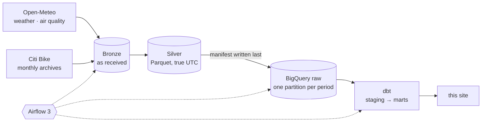

# How is CityPulse built?

```js
import {fmt} from "./components/city.js";
const summary = FileAttachment("data/summary.json").json();
```

<div class="tip" label="What am I looking at?">

The engineering behind the numbers: three public sources, a tested pipeline that proves nothing was lost on the way, and a warehouse model built for this one question. Everything is in the [repository](https://github.com/TomasRipsky/CityPulse_Analytics) — the [guide](https://github.com/TomasRipsky/CityPulse_Analytics/blob/main/docs/guide.md) explains every part, the [decision records](https://github.com/TomasRipsky/CityPulse_Analytics/tree/main/docs/decisions) every choice.

</div>



<div class="answers">
  <div class="answer"><div class="value">${fmt.millions(summary.trips)}</div><div class="label">trips analysed (1 min – 3 h); every row loaded was reconciled against the source files</div></div>
  <div class="answer"><div class="value">${summary.days}</div><div class="label">New York days of hourly weather and air quality — 23 or 25 hours on the days the clocks change</div></div>
  <div class="answer"><div class="value">~150</div><div class="label">automated checks: Python tests, dbt unit, data and integrity tests</div></div>
  <div class="answer warm"><div class="value">≈ €0</div><div class="label">a month: free tiers, budgets and query quotas, nothing always on</div></div>
</div>

## What makes the numbers trustworthy

- **Nothing lost on the way.** Each monthly Citi Bike archive holds several CSV files; every one is read, and the rows parsed must equal the lines counted in the raw file, before anything is published. BigQuery's load is checked against the same count, and a dbt test fails if any day or month ever disagrees.
- **Time is right.** Every timestamp is a true UTC instant; days are New York days, so the clock changes give 23- and 25-hour days, not shifted ones. Rain, reported for the hour that *ended*, is moved to the hour it fell in.
- **Like with like.** Weather effects compare each hour with the same hour, kind of day and month in good weather, so the season does not masquerade as weather.
- **Safe to re-run.** A run that fails leaves the last good data untouched; loading a period twice gives the same table.
- **The blizzard is not a bug.** A test flagged 23 February 2026 with zero trips; the city had shut Citi Bike down during a blizzard. Known closures now live in a sourced table.

## The stack

| | |
|---|---|
| Ingestion | Python 3.13 package (`uv`, `pyarrow`, `httpx`), streaming CSV → Parquet |
| Lake and warehouse | Google Cloud Storage, BigQuery (partitioned, explicit schemas) |
| Transformation | dbt 1.12: staging → intermediate → marts, unit and integrity tests |
| Orchestration | Apache Airflow 3.3 from a versioned image; asset-driven dbt |
| Infrastructure | Terraform: two projects, least-privilege identity, keyless CI (Workload Identity Federation) |
| This site | Observable Framework on GitHub Pages, built from committed exports |

<div class="note">

CityPulse was first built in March 2026 and rebuilt in October 2026 with tests, correct time handling and a complete trip count. The data is frozen: May 2025 to April 2026.

</div>
